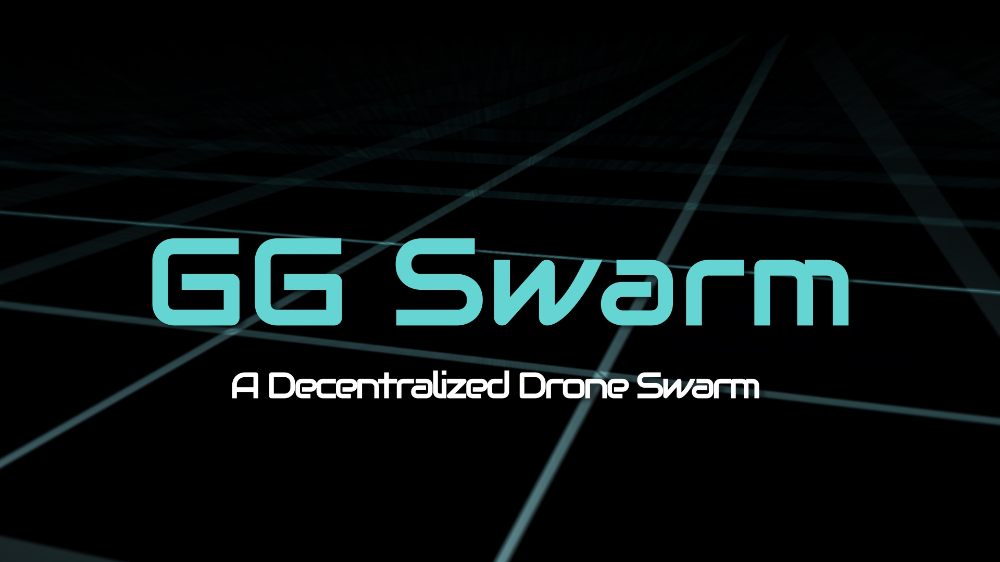

# ggSwarm: Decentralized Formation Control for Drone Swarms



[](https://github.com/astral-sh/ruff)
[](LICENSE)
[](https://www.python.org/downloads/)
[](https://isaac-sim.github.io/IsaacLab/)
[](https://developer.nvidia.com/isaac-sim)


## The Question

**Can a learned GNN policy replace hand-designed multi-agent coordination
logic for drone swarm formation control?**

That is the thesis `ggSwarm` tests. Classical multi-agent coordination
relies on carefully hand-tuned potential fields, consensus protocols, or
auction-based slot assignment. This project asks whether a single Graph
Attention Network (GATv2) policy, trained end-to-end with PPO, can learn
equivalent coordination purely from reward — no hand-designed
coordination logic.

**The answer (as of Phase 4):** Yes, within tested scope. Eight drones
hold triangle, polygon, and letter-G formations with <0.3m steady-state
error, recover from mid-episode dropout within 2s (SwarmRaft), navigate
cylinder forests, and the same policy generalizes to 20 agents without
retraining. See [Testing Report](docs/project/testing_report.md) for
M3 gate results.

## Approach

`ggSwarm` is a high-fidelity multi-drone simulation built on NVIDIA
Isaac Lab + PhysX, running 4096 parallel envs on one GPU. It uses CTDE
(Centralized Training, Decentralized Execution) with a shared PPO
policy and staged milestone delivery.

**Current capabilities:** 8-drone cloud formation with GATv2 GNN (L2), MINCO
minimum-jerk trajectory smoothing (L3), CBF collision avoidance (L4), SwarmRaft
agent dropout/recovery, virtual collision detection, KNN-based scalable cohesion,
obstacle navigation (Phase 4), and a Tron-styled HD cinematic pipeline (Phase 5).

> Developed with [Claude Code](https://claude.com/claude-code)

## Table of Contents

- [Project Navigation](#project-navigation)
- [Quickstart](#quickstart)
- [Training and Playback](#training-and-playback)
- [Schedule and Milestones](#schedule-and-milestones)
- [Troubleshooting](#troubleshooting)
- [License](#license)

## Project Navigation

### Design

- [Architecture](docs/design/architecture.md) — system design source of truth
- [Proposal and project scope](docs/project/proposal.md)

### Phases

- [Phase 1: Foundation](docs/phases/phase1_foundation.md) — Isaac Lab setup, env implementation
- [Phase 2: Brain Development](docs/phases/phase2_brain_development.md) — hover, formation control
- [Phase 3: Muscle Refinement](docs/phases/phase3_muscle_refinement.md) — CBF safety, SwarmRaft, MINCO
- [Phase 4: Stress Testing](docs/phases/phase4_stress_testing.md) — agent loss, obstacles, scale
- [Phase 5: Showcase Prep](docs/phases/phase5_showcase_prep.md) — HD demo, Testing Report
- [Phase 6: Delivery](docs/phases/phase6_delivery.md) — Capstone Festival, submissions
- [Phase 7: Post-Capstone Plan](docs/phases/phase7_post_capstone.md) — deferred work backlog

### Learning Reference

- [Concepts](docs/concepts.md) — ML / RL / GNN glossary scoped to this project

### Status

- [Weekly updates](docs/status/weekly_updates.md)
- [Changelog](docs/status/changelog.md)
- [Run history](docs/status/run_history.md)

## Quickstart

> Isaac Lab is expected to be installed inside your Python virtual environment.
> No sibling `IsaacLab` repository clone is required for this project setup.

1. Clone the repo:

   ```powershell
   git clone https://github.com/garykuepper/ggSwarm.git
   cd ggSwarm
   ```

2. Create and activate a Python 3.11 virtual environment:

   ```powershell
   py -3.11 -m venv env_isaaclab
   env_isaaclab\Scripts\activate
   python -m pip install --upgrade pip
   ```

3. Install Isaac Sim and Isaac Lab into the active virtual environment:
   - Isaac Sim pip package: [NVIDIA Isaac Sim](https://developer.nvidia.com/isaac-sim)
   - Isaac Lab install docs: [Isaac Lab Installation](https://isaac-sim.github.io/IsaacLab/)

4. Install this package:

   ```powershell
   pip install -e source/ggswarm
   ```

5. If you encounter Windows HDF5 DLL conflicts, pin `h5py`:

   ```powershell
   pip install "h5py>=3.9.0,<3.12" --force-reinstall
   ```

## Training and Playback

```powershell
# Train (local, headless)
env_isaaclab/Scripts/python.exe scripts/skrl/train.py --headless `
  --task ggswarm-v0 --num_envs 512 --max_iterations 500 --log_subdir p2a

# Play a checkpoint (GUI)
python scripts/skrl/play.py --task ggswarm-v0 `
  --checkpoint logs/skrl/ggswarm/p2a/<run>/checkpoints/best_agent.pt

# Record video (NVENC H.264)
python scripts/skrl/play.py --task ggswarm-v0 `
  --checkpoint <path> --video --video_prefix p2a-1

# Generate trajectory diagnostic plots
python scripts/skrl/play.py --task ggswarm-v0 `
  --checkpoint <path> --trajectories

# TensorBoard
tensorboard --logdir logs/skrl/ggswarm
```

## Schedule and Milestones

| Phase | Timeline | Gate | Status |
| :--- | :--- | :--- | :--- |
| 1. Foundation | Feb 5 - Feb 17 | - | Complete |
| 2. Brain Development | Feb 25 - Mar 24 | M1 (Mar 25) | Complete |
| 3. Muscle Refinement | Mar 25 - Mar 29 | M2 (Mar 29) | Complete (9 days early) |
| 4. Stress Testing | Mar 30 - Apr 13 | M3 (Apr 13) | Complete |
| 5. Showcase Prep | Apr 14 - Apr 20 | M4 (Apr 20) | Complete |
| 6. Delivery | Apr 21 - Apr 24 | **Final: Apr 24** | **In progress** |

Full timeline: [`docs/project/proposal.md`](docs/project/proposal.md#7-timeline-and-milestones)
| Progress: [`docs/status/weekly_updates.md`](docs/status/weekly_updates.md)

## Troubleshooting

- `ModuleNotFoundError: No module named 'isaacsim'`
  - Ensure the venv is active: `env_isaaclab\Scripts\activate`
- `ModuleNotFoundError: No module named 'isaaclab'`
  - Isaac Lab is not installed in the active venv
- Long path errors on Windows
  - Enable long path support (`LongPathsEnabled = 1`)
- `ImportError: DLL load failed while importing _errors` (`h5py`)
  - Run: `pip install "h5py>=3.9.0,<3.12" --force-reinstall`

## License

This project is licensed under the MIT License. See [`LICENSE`](LICENSE).
