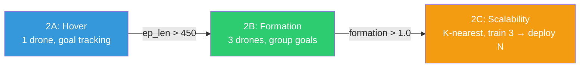

# Phase 2: Brain Development

**Timeline:** Feb 25 -- Mar 27 (Weeks 7--12)  |  **Gate:** M1 -- Formation control

**Status: COMPLETE** (2026-03-27). M1 gate met. Fresh-start rebuild on
2026-03-26 archived the original Phase 1/2 codebase and rebuilt from the
Isaac Lab quadcopter reference. p2b-8 was the final formation checkpoint
(ep_len min=499 zero-crashes, formation reward 1.39, drones visually form
triangle with fixed centroid goal). Phase 2 deliverables fed directly
into Phase 3.

---

## 1. Goals

| ID | Objective | Success Criteria | Status |
| :--- | :--- | :--- | :--- |
| P2.1 | Train shared policy for stable hover | ep_len > 450, no crashes | **PASS** (p2a-1) |
| P2.2 | Formation control with neighbor awareness | Formation reward > 1.0, ep_len > 450 | **PASS** (p2b-8) |
| P2.3 | Scalable deployment (train N, deploy M) | K-nearest obs, same checkpoint works for 3-20 agents | **PASS** (Phase 2C) |
| P2.4 | Curriculum reward shaping | Smooth transition from hover to formation | **PASS** |

---

## 2. Architecture (Fresh Start)

On Mar 26, the entire Phase 2 codebase was archived and rebuilt from
the Isaac Lab quadcopter reference. Key architectural decisions:

- **DirectRLEnv + PPO** (not DirectMARLEnv + MAPPO)
- **1 drone per env**, shared policy across all envs (CTDE)
- **K-nearest neighbors** (K=2) for fixed-size observation regardless of swarm size
- **No GNN in Phase 2** — MLP [64, 64] with concatenated neighbor positions
- **No monkey-patches** — clean SKRL integration

### Sub-phases

| Sub-phase | Task ID | Description | Status |
| :--- | :--- | :--- | :--- |
| 2A: Hover | `ggswarm-v0` (num_agents=1) | Single drone hover to goal | **PASS** (p2a-1 through p2a-4) |
| 2B: Formation | `ggswarm-v0` (num_agents=3) | Multi-drone formation with group goals | **PASS** (p2b-1 through p2b-8) |
| 2C: Scalability | `ggswarm-v0` (num_agents=N) | K-nearest neighbors for train 3 / deploy N | **PASS** |

### Key Source Files

| Component | File |
| :--- | :--- |
| Env | `source/ggswarm/ggswarm/tasks/direct/ggswarm/ggswarm_env.py` |
| Config | `source/ggswarm/ggswarm/tasks/direct/ggswarm/ggswarm_env_cfg.py` |
| PPO config | `source/ggswarm/ggswarm/tasks/direct/ggswarm/agents/skrl_ppo_cfg.yaml` |
| Viz | `source/ggswarm/ggswarm/viz/trajectory_plots.py` |
| Video | `source/ggswarm/ggswarm/viz/nvenc_recorder.py` |
| Train | `scripts/skrl/train.py` |
| Play | `scripts/skrl/play.py` |

### Reward Components (Phase 2B)

| Component | Scale | Formula |
| :--- | :--- | :--- |
| Distance to goal | `+15.0` | `(1 - tanh(dist / 0.8)) * dt` |
| Linear velocity | `-0.05` | `sum(vel^2) * dt` |
| Angular velocity | `-0.05` | `sum(ang_vel^2) * dt` |
| Formation | `+2.0 * alpha` | `(1 - tanh(mean_spacing_error / 0.3)) * dt` |

Curriculum alpha ramps 0 -> 1 over 5000 training steps.

---

## 3. Results

### Phase 2A: Hover (4 runs)

| Run | Config | ep_len | Reward | Verdict |
| :--- | :--- | :--- | :--- | :--- |
| p2a-1 | sigma=0.8, vel=-0.05 (baseline) | 497 | 107 | PASS |
| p2a-2 | sigma=0.3, vel=-0.15 (too tight) | 78 | -0.09 | FAIL |
| p2a-3 | sigma=0.5, vel=-0.10 (middle) | 486 | 97.5 | PASS |
| p2a-4 | sigma=0.8, vel=-0.05 (reset) | 499 | 107 | PASS |

### Phase 2B: Formation (8 runs)

| Run | Config | ep_len | Formation | Verdict |
| :--- | :--- | :--- | :--- | :--- |
| p2b-1 | scale=5.0, curriculum 0/50k | 494 | 0.0 | FAIL (curriculum too slow) |
| p2b-2 | scale=5.0, curriculum 0/5k | 471 | 0.0003 | FAIL (env_origins not subtracted) |
| p2b-3 | env_origins fix | 498 | 0.09 | FAIL (independent goals conflict) |
| p2b-4 | group goals + offsets | 499->71 | 3.5->0.3 | FAIL (collapsed at iter 250) |
| p2b-5 | scale 2.0, ang_vel -0.05 | 499 | 1.59 | PASS (but tumbling in play) |
| p2b-7 | delayed curriculum, ang_vel -0.15 | 324 | 0.34 | FAIL (too aggressive) |
| p2b-8 | **all fixes, curriculum 0/5k** | **499 (min=499)** | **1.39** | **BEST — zero crashes** |

### Phase 2C: Scalability

K-nearest neighbors (K=2) implemented. Train with 3 agents, deploy with
6+ agents using the same checkpoint. Obs stays 18D regardless of swarm size.

---

## 4. Lessons Learned

1. **MAPPO was wrong for homogeneous drones** — separate weights wasteful. PPO with shared policy is correct.
2. **SKRL bypasses gym wrappers** — formation logic must be in the env, not a wrapper.
3. **env_origins must be subtracted** for multi-env formation computation.
4. **Episode timeout stagger** causes drone "despawn" — sync within swarm groups.
5. **Formation reward scale 2.0** (not 5.0) — must be subordinate to hover base.
6. **ang_vel penalty -0.05** is the sweet spot — -0.15 kills the policy.
7. **Group-aware goal sampling** — shared centroid + formation slot offsets.
8. **Correct circumradius** — `spacing / (2 * sin(pi/N))` for exact pairwise distance.

---

## See Also

- [Architecture](../design/architecture.md)
- [Changelog](../status/changelog.md)
- [Phase 3: Muscle Refinement](phase3_muscle_refinement.md)
