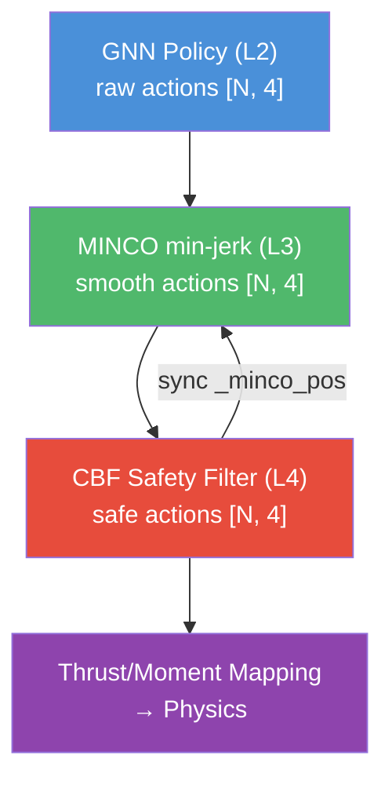

# Phase 3: Muscle Refinement

**Timeline:** Mar 25 -- Mar 29 (Weeks 9--11)  |  **Gate:** M2 -- Logic integration complete by ~~Apr 7~~ Mar 29

**Status: COMPLETE** (2026-03-29, 9 days ahead of M2 gate)

---

## 1. Goals

Phase 3 adds the GATv2 GNN policy backbone (core proposal deliverable) and
post-policy filters for safety, smoothing, and fault recovery. All post-policy
components are config-gated and do not require retraining.

| ID | Objective | Success Criteria | Status |
| :--- | :--- | :--- | :--- |
| P3.1 | GATv2 GNN policy replaces MLP | Same or better formation performance as MLP | **Complete** — K-hop sparse edges, edge cache for PPO replay |
| P3.2 | MINCO trajectory smoothing | >= 20% reduction in velocity jitter | **Complete** — min-jerk filter (T=0.04s), supersedes EMA |
| P3.3 | CBF collision avoidance | Zero collisions across 10 episodes | **Complete** — QP-inspired, MINCO-synced, clamped corrections |
| P3.4 | SwarmRaft agent dropout | Formation re-syncs within 2.0 s | **Complete** — cloud-mode alive mask, dead drone exclusion |
| P3.5 | Virtual collision detection | Hard training signal for close approaches | **Complete** — pairwise distance check, collective group reset |

---

## 2. Architecture

### Full L2-L4 Stack (as shipped)



### GATv2 GNN Policy (L2)

- 2-layer GATv2 with K=2 nearest neighbor sparse edges
- Edge cache: replays KNN edges during PPO mini-batch update
- Bidirectional edges (32 per group for A=8)
- Env publishes KNN edge_index to policy each step

**Key files:** `gnn_policy.py`, `ggswarm_env.py` (`_expand_obs_with_neighbors`)

### MINCO Minimum-Jerk Filter (L3)

Single-segment minimum-jerk (s=3) trajectory optimization. At each step,
computes the unique 5th-order polynomial that minimizes integral of squared
jerk from current state (pos, vel, acc) to GNN target over horizon T=0.04s.

- Provides C2-continuous actions — supersedes EMA smoother
- State synced to post-CBF output (corrections are sticky)
- Config: `minco_enabled`, `minco_horizon = 0.04`

**Key file:** `minco.py`

### CBF Safety Shield (L4)

QP-inspired barrier constraint enforcement. For each pair (i,j):
`h_dot + gamma * h >= 0`. When violated, applies clamped correction
along normalized escape direction.

- Max correction per channel: 0.15 (avoids destabilizing hover)
- Symmetric correction to both drones in pair
- Accepts alive_mask for SwarmRaft integration
- Config: `cbf_enabled`, `cbf_d_safe = 0.30m`, `cbf_gamma = 2.0`

**Key file:** `cbf.py`

### SwarmRaft Agent Dropout (L3 Consensus)

Simulated agent failure via `_agent_alive [N]` boolean mask. At a random
step (100-250), one drone per group is killed. Dead drones excluded from
KNN, CBF, rewards, collision checks, and altitude death.

- KNN topology self-heals (neighbors reconnect to alive drones)
- Centroid computed from alive drones only
- Config: `dropout_enabled`, `dropout_step_min/max`, `dropout_count`

### Virtual Collision Detection

Pairwise distance check within swarm groups against `collision_radius=0.10m`.
Triggers collective group reset — hard training signal for separation learning.

### KNN-Based Cohesion

Replaced centroid cohesion with mean K-nearest neighbor distance reward.
Scales to any swarm size (no centroid dependency). Merged with spacing
penalty into single loop.

---

## 3. Key Training Runs

| Run | Key Change | Reward | Ep Len | KNN Range | Verdict |
| :--- | :--- | :--- | :--- | :--- | :--- |
| p3-15 | K-hop sparse edges + edge cache | 61.9 | 431 | 0.10-0.50m | Baseline |
| p3-17 | CBF-QP fix (clamped corrections) | 65.3 | 463 | 0.10-0.50m | PASS |
| p3-19 | MINCO T=0.04s | 46.3 | 472 | 0.15-0.60m | PASS (smoother attitude) |
| p3-21 | Collision termination, 1000 iter | 22.8 | 131 | 0.20-0.50m | Learning |
| p3-23 | MINCO-CBF sync + spawn 0.5m | 19.0 | 109 | 0.25-0.60m | PASS (CBF sticky) |
| p3-24 | Separation penalty 20 + random Z spawn | 36.4 | 242 | 0.30-0.60m | **Best overall** |
| p3-26 | SwarmRaft dropout (fixed) | 19.6 | 332 | 0.30-0.60m | PASS (7/8 survive) |

### Key Findings

- **CBF-QP unclamped corrections** (p3-16) caused drone tumbling — correction magnitude must be capped
- **MINCO horizon** critically affects responsiveness: 0.10s too sluggish, 0.04s works well
- **MINCO-CBF state sync** essential — without it, MINCO overwrites CBF corrections every step
- **Centroid cohesion doesn't scale** — replaced with KNN-based cohesion for 20+ agent scalability
- **Virtual collision termination** is the strongest training signal for separation learning
- **SwarmRaft dead drone death exclusion** required — dead drones fall and cascade-crash group without it

---

## 4. Scope-Cut Rules (final status)

- **P3.1 (GNN):** Shipped. GATv2 with K-hop sparse edges.
- **P3.2 (MINCO):** Shipped. Supersedes EMA. Min-jerk at T=0.04s.
- **P3.3 (CBF):** Shipped. QP-inspired, MINCO-synced.
- **P3.4 (SwarmRaft):** Shipped. Cloud-mode dropout with alive mask.
- **P3.5 (Circular orbit):** Deferred to Phase 4 (stretch goal).

---

## 5. Implementation Timeline (actual)

```text
Day 1 (Mar 27):   GATv2 GNN edges fixed (fully-connected → K-hop sparse)
Day 2 (Mar 28):   Edge cache for PPO replay; CBF-QP rewrite
Day 3 (Mar 28-29): MINCO L3 layer; virtual collision detection
Day 4 (Mar 29):   KNN cohesion; MINCO-CBF sync; separation tuning
Day 5 (Mar 29):   SwarmRaft agent dropout; Phase 3 wrap-up
```

M2 gate (Apr 7) met 9 days early.

---

## See Also

- [Phase 2: Brain Development](phase2_brain_development.md)
- [Phase 4: Stress Testing](phase4_stress_testing.md)
- [Changelog](../status/changelog.md)
- [Run History](../status/run_history.md)
