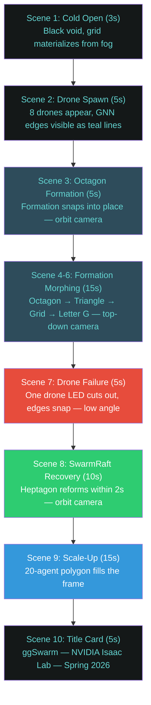
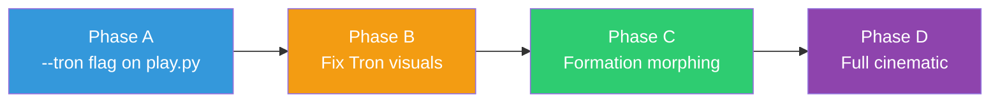

# Phase 5: Showcase Prep

**Timeline:** Apr 14 -- Apr 20  |  **Gate:** M4 -- HD showcase and Testing Report delivered

**Status: COMPLETE** (2026-04-08). Started 2026-04-07,
**12 days ahead of the original Apr 20 gate.** Cinematic trailer
edited and published to YouTube; project banner added to README.
Sub-phases B/C/D remain deferred (see below) — the manual edit of the
20 captured clips fully satisfies the M4 deliverable. Phase 4 wrapped after the
forest-deflection rebuild produced clean obstacle navigation
(`p4-revert-4` checkpoint, 0 body penetrations through 0.20m-radius trunks).

Phase 5 sub-phase A delivered:

- **Tron baseline pipeline** in `scripts/skrl/play.py` behind `--tron`
  (commits `e5dcbb7c` → `1d95af2c`). 7 commits total.
- **20 stitchable cinematic clips** in `videos/showcase/` covering 4
  formations × multiple agent counts × 4 camera modes (`orbit`,
  `top_down`, `low_angle`, `chase`) + cold-open shots + forest with
  red-wireframe trees.
- **Fully documented setup reference** in § 0 below — captures the
  two-day debugging journey (USD instancing, linear-RGB color space,
  `sim.set_camera_view` vs `viewport.set_active_camera`, texture-based
  terrain) so future visual work doesn't re-walk the same traps.

**Sub-phase B/C/D (cinematic 3-point lighting, scene morphing
sequencer, full automated cinematic) are deferred** — manual editing
in DaVinci Resolve / Premiere with the 20 captured clips covers the
M4 deliverable. See § 5 (Results) for the full inventory and the
out-of-scope list.

**Production checkpoint:** [logs/skrl/ggswarm/p4/2026-04-06_21-09-24_ppo_torch/checkpoints/best_agent.pt](../../logs/skrl/ggswarm/p4/2026-04-06_21-09-24_ppo_torch/checkpoints/best_agent.pt)
(reward 66.83, ep_len 307.74, formation tracking + flock-aligned forest
navigation).

## 0. Tron Baseline — Setup Reference (commit `eb958dd0`)

**This section locks in the working Tron baseline so we don't have to
re-derive it next time we touch visuals.** It took two days, hours of
guess-and-check, and an Isaac Lab GitHub issue to get here. The baseline
is implemented entirely in [scripts/skrl/play.py](../../scripts/skrl/play.py)
behind `--tron`. Both `tron_env.py` and `showcase.py` are unchanged and
unused — the all-in-one `setup_tron_environment()` from `tron_env.py`
made debugging impossible (it does ~6 things at once: light removal,
render mode change, fog, grid, lighting, materials), so the rebuild
adds each Tron feature as a single inline step in `play.py`.

### Final pipeline (in order, all inside `if args_cli.tron:`)

| Iter | What | Why |
| :--- | :--- | :--- |
| **1** | Traverse stage, remove every `UsdLux` light by type name | Default lights painted the scene; the hardcoded path list in `tron_env._set_black_void` missed `/World/ground/terrain/SphereLight` |
| **4** | `sim_utils.make_uninstanceable` on each drone | Crazyflie is instanceable; without this, all `diffuseColor.Set()` calls below silently no-op (visuals frozen at the prototype) |
| **2** | Edit existing `DroneMat` shader's `diffuseColor`/`emissiveColor` in place to amber linear `(1.0, 0.262, 0.0)` | Reuses the env's existing material instead of fighting binding strength with a new one |
| **5** | Remove `/World/ground`, spawn 50m flat black quad via `sim_utils.spawn_preview_surface` | Terrain has a baked grid texture that overrides constant `diffuseColor`; replace with a flat invisible substrate |
| **6** | Spawn 102 thin quads (51 H + 51 V, 2cm × 50m, 2m spacing) at z=0.005 with bright cyan emissive material `(0.3, 3.0, 2.8)` linear | The lines ARE the visible grid — geometry can't be defeated by sampler caches |

The orbit camera is positioned per-frame via direct
`env.unwrapped.sim.set_camera_view(eye, target)` calls in the play loop
— **not** via `TronCameraRig` or `viewport.set_active_camera`, both of
which only updated the live Kit viewport instead of the env render
camera that `NvencRecorder` actually reads from. Z-up math (Isaac Lab
convention, not the Y-up that `TronCameraRig` assumed):

```text
angle += speed_deg
rad = radians(angle)
eye_x = centroid_x + radius * sin(rad)
eye_y = centroid_y + radius * cos(rad)
eye_z = centroid_z + height
target = (centroid_x, centroid_y, centroid_z)
```

Defaults: `radius=2.0m`, `height=0.6m`, `speed=0.6 deg/frame`. At 250
frames per clip that's 150° of arc — about 40% of a full orbit, enough
parallax for a cinematic shot.

### Things that look like they should work but don't

These are the traps the rebuild walked into. Documenting so we don't
re-walk them:

- **Setting `diffuseColor` on an instanceable Crazyflie shader.** Returns
  a valid `UsdShadeInput`, accepts the `Set()` call, looks like it works
  in the USD layer dump. Has zero visual effect because the prototype
  visuals are cached. Always `make_uninstanceable` first when targeting
  Isaac Lab assets that came from a USD reference.
- **Modifying the terrain's grid color.** The grid lines are baked into
  a tileable texture sampled by the terrain shader. The constant
  `diffuseColor` only tints the base; the texture re-paints the lines on
  top every frame. The "cyan flash" at the start of the iter 3 attempt
  was the constant briefly winning before the sampler kicked in.
- **`viewport.set_active_camera()` for video recording.** Updates the
  live Kit viewport but **NvencRecorder reads from `env.render()`**,
  which uses the env's internal viewer driven by
  `ViewportCameraController.update_view_location` →
  `sim.set_camera_view()`. Two separate camera pipelines.
- **`TronCameraRig` math from `tron_env.py`.** It's Y-up, Isaac Lab is
  Z-up. The rig's `_update_orbit` formula puts the camera at
  `y = target.y + height` which in Z-up is *horizontal offset*, not
  *up*. The drones end up small and offset in the frame.
- **Path tracing (`/rtx/rendermode = PathTracing`).** When you remove
  the dome light, path tracing loses its environment to sample from and
  paints the background red as a fallback. `RaytracedLighting` (real-time
  RT) respects `/rtx/backgroundColor*` settings and was the right choice.
  Even better: with the geometric `make_uninstanceable` + custom plane
  approach, render mode doesn't really matter — the visible surface is
  geometry, not a fallback color.
- **`spawn_preview_surface(diffuse_color=(1.0, 0.55, 0.0))` displaying
  as orange.** All Isaac Lab visual material color inputs are LINEAR RGB
  (per `IsaacLab/source/isaaclab/isaaclab/sim/spawners/materials/visual_materials.py`
  line 30 docstring). To display sRGB `#ff8c00 = (1.0, 0.549, 0.0)`,
  pass linear `(1.0, 0.262, 0.0)` (gamma decode `0.549^2.2 ≈ 0.262`).
  The amber drones in the current baseline still read as more yellow
  than amber in the final video — this is a known refinement target,
  not a known bug.

### Reference video

[`videos/showcase/p5-iter6-grid-tuned-episode-0.mp4`](../../videos/showcase/p5-iter6-grid-tuned-episode-0.mp4)
— canonical baseline clip. Black sky, black floor, bright cyan grid
(2m cells, 2cm lines), amber-ish drones in triangle formation,
orbit camera around the swarm centroid.

### Reproducing the baseline

```text
env_isaaclab/Scripts/python.exe scripts/skrl/play.py --task ggswarm-v0 \
  --num_agents 8 \
  --checkpoint logs/skrl/ggswarm/p4/2026-04-06_21-09-24_ppo_torch/checkpoints/best_agent.pt \
  --tron --formation triangle \
  --video --video_length 250 --play_length 250 \
  --prefix p5-baseline
```

### Tunable knobs (all in `play.py` `--tron` block)

| Variable | Current | What it controls |
| :--- | :--- | :--- |
| `tron_orbit["radius"]` | 2.0 | XY orbit radius around centroid (m) |
| `tron_orbit["height"]` | 0.6 | Z offset above centroid (m) |
| `tron_orbit["speed_deg"]` | 0.6 | degrees per frame (0.6 × 250 = 150° per clip) |
| `_AMBER` | `(1.0, 0.262, 0.0)` | Drone diffuse linear RGB (sRGB `#ff8c00`) |
| `_AMBER_BRIGHT` | `(1.5, 0.39, 0.0)` | Drone emissive linear RGB |
| `_size` (iter 5) | 50.0 | Half-extent of base plane and grid (m) |
| `_line_w` (iter 6) | 0.01 | Half-width of grid line quads (m) |
| `_spacing` (iter 6) | 2.0 | Distance between grid lines (m) |
| Lines emissive | `(0.3, 3.0, 2.8)` | Bright cyan glow on lines, linear RGB |

### Iter 7 — forest cylinder wireframe (commit `b0070351`)

When `--tron` and `--forest` are both passed, each forest cylinder is
restyled as a Tron wireframe in red:

1. Existing `/World/envs/env_*/Obstacle_*` cylinder bodies become
   `make_uninstanceable` + paint their existing PreviewSurface fully
   black. The cylinder body stays as a solid silhouette so the
   wireframe has a 3D occluder.
2. **24 vertical red strips** per cylinder, evenly distributed every
   15° around the circumference, each a 3.6cm × 1.5m thin tangent quad
   at radius * 1.02. All combined into one mesh at
   `/World/TronObstacleStrips`.
3. **5 mid-height annulus rings + 1 thicker top-edge ring** per
   cylinder, all in one mesh at `/World/TronObstacleRings`. Annulus =
   32 angular segments between an inner and outer radius. **Important:
   the previous "ring" attempts used `UsdGeom.Cylinder` primitives,
   which rendered as solid disks** because Cylinder is a solid volume.
   An annulus mesh is the actual ring shape with a hole in the middle.

Total per cylinder: 24 strips + 6 rings = 30 wireframe features. Forest
navigation behavior is unchanged — only visuals.

### `--cam_mode` flag (commit `2d15fa03`)

Adds `--cam_mode {orbit, top_down, low_angle, chase}` to play.py. The
mode is stored in `tron_orbit["mode"]` and the per-frame camera step
branches on it; all four use the same live-centroid tracking via
`env.unwrapped.sim.set_camera_view()` so they record correctly.

| Mode | Description | Best for |
| :--- | :--- | :--- |
| `orbit` (default) | radius 2m, height 0.6m, 0.6 deg/frame slow rotation | Single-formation reveal shots |
| `top_down` | locked overhead at 3m above centroid + 0.15 deg/frame yaw drift | Formation shape reveal (octagon, grid, letter G) |
| `low_angle` | radius 4m, z=-0.4 below centroid, looks up at z+0.4. Slow arcing | Dropout / drama scenes |
| `chase` | trails centroid in -X at distance 3.5m, height 1.2m, no rotation | Forest navigation — "flying with the swarm" |

Tunable knobs are stored in the `tron_orbit` dict at the top of the
`--tron` block — radius, height, speed, top_down_height, chase_back, etc.

### Tunable knobs (all in `play.py` `--tron` block)

| Variable | Current | What it controls |
| :--- | :--- | :--- |
| `tron_orbit["radius"]` | 2.0 | XY orbit radius around centroid (m) |
| `tron_orbit["height"]` | 0.6 | Z offset above centroid for orbit (m) |
| `tron_orbit["speed_deg"]` | 0.6 | Orbit angular speed (deg/frame) |
| `tron_orbit["top_down_height"]` | 3.0 | Z above centroid for top-down (m) |
| `tron_orbit["top_down_yaw_speed"]` | 0.15 | Top-down yaw drift (deg/frame) |
| `tron_orbit["chase_back"]` | 3.5 | Chase camera distance behind (m) |
| `tron_orbit["chase_height"]` | 1.2 | Chase camera Z offset (m) |
| `_AMBER` | `(1.0, 0.262, 0.0)` | Drone diffuse linear RGB |
| `_AMBER_BRIGHT` | `(1.5, 0.39, 0.0)` | Drone emissive linear RGB |
| `_size` (iter 5) | 50.0 | Half-extent of base plane + grid (m) |
| `_line_w` (iter 6) | 0.01 | Half-width of grid line quads (m) |
| `_spacing` (iter 6) | 2.0 | Distance between grid lines (m) |
| Lines emissive | `(0.3, 3.0, 2.8)` | Bright cyan grid lines, linear RGB |
| `_n_strips` (iter 7) | 24 | Vertical red strips per forest cylinder |
| `_strip_w` (iter 7) | 0.018 | Half-width of cylinder strips (m) |
| `_ring_fracs` (iter 7) | `[0.1, 0.275, 0.45, 0.625, 0.8]` | Z fractions of mid-height rings |
| `_top_outer` (iter 7) | `r * 1.18` | Outer radius of top edge ring |

### Captured clip inventory (Phase 5 sub-A wrap, 2026-04-08)

All in [`videos/showcase/`](../../videos/showcase/) at the repo root.
17 stitchable clips, all rendered against the production checkpoint
`p4-revert-4` (`logs/skrl/ggswarm/p4/2026-04-06_21-09-24_ppo_torch/`).

| Clip | Mode | Formation | N | Length | Notes |
| :--- | :--- | :--- | :--- | :--- | :--- |
| `p5-baseline-orbit-zoom2` | orbit | triangle | 8 | 5s | Baseline reference |
| `p5-orbit-octagon-10s` | orbit | polygon | 8 | 10s | Scene 3 |
| `p5-orbit-triangle-10s` | orbit | triangle | 8 | 10s | Scene 2/3 |
| `p5-orbit-grid-10s` | orbit | grid | 8 | 10s | Scene 4 |
| `p5-orbit-letter-G-10s` | orbit | letter_G | 8 | 10s | Scene 6 |
| `p5-orbit-letter-G-16` | orbit | letter_G | 16 | 10s | Bigger letter G |
| `p5-orbit-letter-G-16-15s` | orbit | letter_G | 16 | 15s | Extended letter G |
| `p5-orbit-scale-20` | orbit | polygon | 20 | 10s | Scene 9 scale-up |
| `p5-orbit-dropout` | orbit | triangle + `--dropout` | 8 | 10s | Scenes 7-8 |
| `p5-orbit-forest-wireframe3` | orbit | triangle + `--forest` | 8 | 10s | Forest with red wireframe trees |
| `p5-orbit-cloud-10s` | orbit | `--cloud` | 8 | 10s | Off-distribution boid attempt |
| `p5-topdown-triangle-3m` | top_down | triangle | 8 | 10s | Scene 4 reveal |
| `p5-topdown-octagon` | top_down | polygon | 8 | 10s | Scene 4 reveal |
| `p5-topdown-grid` | top_down | grid | 8 | 10s | Scene 5 reveal |
| `p5-topdown-letter-G-16` | top_down | letter_G | 16 | 10s | Scene 6 reveal |
| `p5-topdown-letter-G-16-15s` | top_down | letter_G | 16 | 15s | Extended scene 6 |
| `p5-topdown-forest` | top_down | triangle + `--forest` | 8 | 10s | Forest from above |
| `p5-chase-forest-15s` | chase | triangle + `--forest` | 8 | 15s | Forest fly-through |

**That's enough material to manually stitch the cinematic trailer in
DaVinci Resolve / Premiere with title cards + transitions + music.**

### Next iterations (deferred — only if needed beyond manual stitching)

Tracked post-capstone as
capstone-frozen polish (not on the ggSwarm Live roadmap; see [backlog](../../ggswarm_live/backlog.md) row F1–F6).

- **Drone color refinement** — currently more yellow than amber. Try
  bumping linear green even lower to compensate for renderer tone
  mapping, or try a magenta/red instead.
- **Cinematic 3-point lighting** in cyan tones for proper shading.
  Drones currently lit only by grid emission and look flat.
- **Volumetric fog** for atmosphere. Risky — caused white-outs in
  earlier `tron_env` attempts. Add carefully if needed.
- **Lift `TRON_AMBER`, `TRON_TEAL`, `TRON_LINE_WIDTH` etc. into
  `GgswarmEnvCfg`** as named constants per the user's earlier
  suggestion. Currently hardcoded in play.py.
- **Cold open** — needs `--no_drones` flag or a separate minimal entry
  script that spawns just the Tron environment with no agents. Scene 1.
- **Cloud / boid retraining** — would need a fresh GCE training run with
  `formation_mode = "cloud"` for ~500 iterations. Currently out of GCE
  credits, so deferred.
- **Showcase script integration** (`scripts/showcase.py` already
  exists with full 8-scene morphing logic) — would produce a single
  auto-edited cinematic instead of clips for manual editing. Not
  needed if the manual workflow is sufficient.

## 1. Goals

| ID | Goal | Success Criteria |
| :--- | :--- | :--- |
| P5.1 | Cinematic trailer (~2:30) | Tron-inspired, 1080p 60fps, 8 scenes, formation morphing + dropout |
| P5.2 | Proposal objectives verified | Testing Report finalized with pass/fail for O1-O4 — **DONE 2026-04-08** ([docs/testing_report.md](../testing_report.md)) |
| P5.3 | Formation error < 0.3m steady-state | Verified across evaluation suite |
| P5.4 | Presentation-ready repository | Clean README, reproducible commands |

## 2. Cinematic Trailer (P5.1)

### Concept

Tron Legacy-inspired cinematic showcase. Dark void, volumetric teal fog,
emissive drone materials, cinematic camera rigs. Signature color: #64d5d2
(Gary Gigabytes teal). ~2:30 runtime at 1080p 60fps.

### Storyboard



### Technical Implementation

| Component | File | Description |
| :--- | :--- | :--- |
| Tron environment | `scripts/tron_env.py` | Black void, fog, grid, lighting, drone materials, camera rigs |
| Showcase script | `scripts/showcase.py` | Scene sequencer, formation morphing, dropout orchestration |
| Trained policy | p4-6 checkpoint | Triangle mesh + dropout trained, generalizes to all shapes |

### Tron Environment Features

- **Black void stage** — default lights removed, RTX path tracing enabled (32 SPP)
- **Volumetric fog** — tinted #64d5d2, subtle density (0.08), 3-25m range
- **Emissive grid plane** — 50m quad with teal OmniPBR emissive material
- **3-point cinematic lighting** — key (teal-white), fill (navy), rim (bright teal edge glow)
- **Drone material** — near-black metallic body + #64d5d2 emissive LED at intensity 10

### Camera Rigs (TronCameraRig)

| Mode | Description | Used In |
| :--- | :--- | :--- |
| `orbit` | Slow 360° around swarm centroid | Scenes 1-3, 8-10 |
| `top_down` | Locked overhead — formation shape reveal | Scenes 4-6 |
| `low_angle` | Dramatic ground-level looking up | Scene 7 (drone failure) |
| `chase` | Follows swarm centroid | Optional |

### Implementation Plan (incremental, 4 phases)

Build the showcase incrementally — each phase independently testable.
Do NOT try to do everything at once.



**Phase A: `--tron` flag on play.py** (~30 lines)

Add Tron visuals to the existing working play.py. No new wrapper ordering,
no scene sequencing. Just call `setup_tron_environment()` after `gym.make()`
but before `NvencRecorder`, create a `TronCameraRig`, and step it each frame.

```powershell
python scripts/skrl/play.py --task ggswarm-v0 --checkpoint <path> `
    --tron --video --prefix p5-tron-test
```

**Phase B: Fix Tron visuals** (iterative)

Debug colors: verify `/World/Light` and `/World/ground` removal, test
emissive materials in RTX-Interactive vs Path Tracing mode, tweak fog
density and grid material. Only modify `scripts/tron_env.py`.

**Phase C: Formation morphing via `--showcase`** (~50 lines)

Add `--showcase` flag to play.py that enables scripted formation changes
at timed intervals. Reuse existing `get_formation()` + nearest-slot
assignment. No separate showcase.py needed.

```powershell
python scripts/skrl/play.py --task ggswarm-v0 --checkpoint <path> `
    --tron --showcase --video --prefix p5-showcase
```

**Phase D: Full cinematic** (drone kill + camera cuts)

Add SwarmRaft dropout trigger, camera mode switching (orbit → top_down →
low_angle), and optional scale-up. Either extend play.py `--showcase`
or keep in separate `scripts/showcase.py`.

### Files

| Phase | File | Changes |
| :--- | :--- | :--- |
| A | `scripts/skrl/play.py` | `--tron` flag, call setup_tron_environment, step TronCameraRig |
| B | `scripts/tron_env.py` | Fix light/ground removal, test materials |
| C | `scripts/skrl/play.py` | `--showcase` flag with formation timer |
| D | `scripts/showcase.py` or `play.py` | Drone kill, camera cuts |

## 3. Testing Report (P5.2) — DONE 2026-04-08

Delivered: [`docs/testing_report.md`](../testing_report.md). Compiles Phase 4 evaluation results:

- Objective pass/fail table (O1-O4) with measured values
- Formation error metrics by scenario (polygon, grid, letter, scale)
- SwarmRaft recovery time measurements
- MINCO jitter A/B comparison data
- Scale benchmark results (8, 10, 15, 20 agents)
- Trajectory plot gallery

## 4. Design Integration

No architectural changes. Consumes Phase 4 validated stack and packages
for presentation.

| Deliverable | Source |
| :--- | :--- |
| Cinematic trailer | `scripts/showcase.py` + `scripts/tron_env.py` |
| Demo clips | `scripts/skrl/play.py` with `--prefix` |
| Trajectory plots | `ggswarm.viz.trajectory_plots` |
| Testing Report | Phase 4 evaluation data + `scripts/eval_metrics.py` |

## 5. Results

**Sub-phase A COMPLETE (2026-04-08).** The originally-planned
`scripts/showcase.py` + `scripts/tron_env.py` (created Mar 31) was
**superseded** by the in-`play.py` `--tron` rebuild on Apr 7-8 because
the all-in-one `setup_tron_environment()` function did ~6 things at
once and made debugging impossible. The rebuilt pipeline is documented
in § 0 above; `showcase.py` and `tron_env.py` are unchanged on disk
but unused by the current cinematic workflow.

### Production checkpoint

`logs/skrl/ggswarm/p4/2026-04-06_21-09-24_ppo_torch/checkpoints/best_agent.pt`
— reward 66.83, ep_len 307.74, polygon-mode triangle formation
training, flock-aligned forest navigation. Same checkpoint feeds every
clip below.

### 20 stitchable clips in `videos/showcase/`

| # | Clip | Mode | Formation | N | Length | Notes |
| :--- | :--- | :--- | :--- | :--- | :--- | :--- |
| 1 | `p5-baseline-orbit-zoom2` | orbit | triangle | 8 | 5s | Baseline reference |
| 2 | `p5-orbit-octagon-10s` | orbit | polygon | 8 | 10s | Scene 3 — octagon |
| 3 | `p5-orbit-triangle-10s` | orbit | triangle | 8 | 10s | Scene 2/3 — triangle |
| 4 | `p5-orbit-grid-10s` | orbit | grid | 8 | 10s | Scene 4 — grid |
| 5 | `p5-orbit-letter-G-10s` | orbit | letter_G | 8 | 10s | Scene 6 — letter G |
| 6 | `p5-orbit-letter-G-16` | orbit | letter_G | 16 | 10s | Bigger letter G |
| 7 | `p5-orbit-letter-G-16-15s` | orbit | letter_G | 16 | 15s | Extended letter G |
| 8 | `p5-orbit-scale-20` | orbit | polygon | 20 | 10s | Scene 9 — scale up |
| 9 | `p5-orbit-dropout` | orbit | triangle + `--dropout` | 8 | 10s | Scenes 7-8 |
| 10 | `p5-orbit-forest-wireframe3` | orbit | triangle + `--forest` | 8 | 10s | Forest with red wireframe trees |
| 11 | `p5-orbit-cloud-10s` | orbit | `--cloud` (off-distribution) | 8 | 10s | Boid attempt |
| 12 | `p5-topdown-triangle-3m` | top_down | triangle | 8 | 10s | Scene 4 reveal |
| 13 | `p5-topdown-octagon` | top_down | polygon | 8 | 10s | Scene 4 reveal |
| 14 | `p5-topdown-grid` | top_down | grid | 8 | 10s | Scene 5 reveal |
| 15 | `p5-topdown-letter-G-16` | top_down | letter_G | 16 | 10s | Scene 6 reveal |
| 16 | `p5-topdown-letter-G-16-15s` | top_down | letter_G | 16 | 15s | Extended scene 6 |
| 17 | `p5-topdown-forest` | top_down | triangle + `--forest` | 8 | 10s | Forest from above |
| 18 | `p5-chase-forest-15s` | chase | triangle + `--forest` | 8 | 15s | Fly-along forest |
| 19 | `p5-orbit-no-drones-clean` | orbit | `--no_drones` | — | 10s | Cold open (env only) |
| 20 | `p5-orbit-no-drones-forest` | orbit | `--no_drones --forest` | — | 10s | Cold open + forest reveal |

### Reproduction matrix

All clips render from a single play.py invocation against the
production checkpoint. Flag combinations:

```text
play.py --task ggswarm-v0
        --num_agents {8 | 16 | 20}
        --checkpoint logs/.../p4-revert-4/best_agent.pt
        --tron
        [--formation {polygon | triangle | grid | letter_G}]
        [--num_agents N]
        [--forest]
        [--dropout]
        [--cam_mode {orbit | top_down | low_angle | chase}]
        [--no_drones]
        [--cloud]
        --video --video_length {500 | 750}
        --play_length {500 | 750}
        --prefix p5-...
```

500 frames = 10s at dt=0.02. 750 frames = 15s. All output goes to
`videos/showcase/` at the repo root.

### Next steps

**Manual cinematic editing** in DaVinci Resolve / Premiere using the
20 captured clips + title cards + music. **No more code changes are
required for the trailer.** This is now a Phase 6 task (delivery sprint).

### Deferred (only if time permits before Apr 24)

- **Drone color refinement** — currently more yellow than amber
- **Cold open at slower orbit speed** — current `--no_drones` orbit is
  the same speed as the regular orbit; for a true "establishing shot"
  feel, halve the orbit speed
- **Cinematic 3-point lighting** in cyan tones
- **Cloud/boid clip** with a fresh GCE training run (out of credits)
- **Showcase script integration** — `scripts/showcase.py` already has
  the 8-scene morphing logic if a single auto-edited cinematic is
  preferred over manual editing

---

## See Also

- [Phase 4: Stress Testing](phase4_stress_testing.md)
- [Phase 6: Delivery](phase6_delivery.md)
- [Assumptions](../design/assumptions.md)
