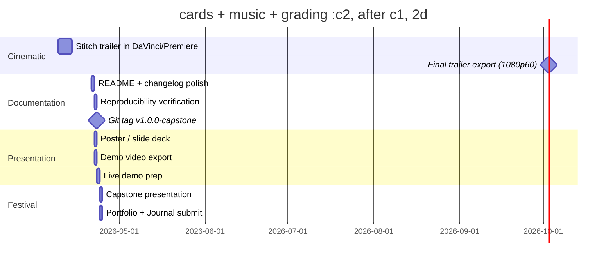

# Phase 6: Delivery

**Timeline:** Apr 21 -- Apr 24  |  **Gate:** Final -- Capstone Festival presentation and all submissions

**Status: In progress.** Phase 5 wrapped 2026-04-08 — cinematic
trailer edited and published to YouTube, project banner added to
README. Remaining Phase 6 work: Capstone Festival presentation,
Portfolio + Learning Journal submission, final documentation sweep,
and reproducibility check from a clean clone.

**16 days remaining to deadline (as of 2026-04-08).** All training is
done. Production checkpoint locked in (`p4-revert-4`). No more code
changes are required for the trailer; only editing, polish, and
submission.

## 1. Goals

| ID | Goal | Success Criteria |
| :--- | :--- | :--- |
| P6.1 | Capstone Festival presentation delivered | Live demo or recorded video at poster session |
| P6.2 | Portfolio and Learning Journal submitted | Per-course requirements met by Apr 24 |
| P6.3 | Repository reproducible from scratch | Reviewer can train/play using only README |
| P6.4 | Final documentation complete | All phase docs and architecture doc up to date |

**Hard deadline: Apr 24, 2026.** All work must be complete and submitted.

## 2. Tasks



No new training. Most code work is done — Phase 4 produced the
production checkpoint, Phase 5 sub-A produced the cinematic clip
inventory. Phase 6 is editing, polish, and submission.

### Days 1-7 (Apr 9-15): Cinematic stitching

- **Open the 20 clips from `videos/showcase/`** in DaVinci Resolve or
  Premiere. Inventory:
  - Orbit clips (8): octagon, triangle, grid, letter_G (8 + 16 agents),
    scale-20, dropout, forest with wireframe trees
  - Top-down clips (5): triangle, octagon, grid, letter_G-16, forest
  - Chase clip (1): forest fly-along (15s)
  - Cold open clips (2): no-drones orbit + no-drones forest
  - Off-distribution (1): cloud / boid attempt (probably skip)
- **Build the trailer per the storyboard** in
  [phase5_showcase_prep.md § 2](phase5_showcase_prep.md):
  cold open → drone spawn → octagon → formation morph → dropout →
  recovery → scale-up → title card. Target ~2:30 at 1080p 60fps.
- **Title cards** (intro/outro/scene labels), **transitions**
  (cuts + crossfades), **color grading** if needed.
- **Music** — pick a Tron-Legacy-adjacent track (creative-commons or
  licensed). Pace cuts to the music.
- **Export final cinematic** (1080p60 H.264, audio embedded). Target
  file size < 100 MB so it fits in submissions.

### Days 8-14 (Apr 16-20): Slack / polish / contingency

- Re-render any clip if visual issues found during editing.
- Optional: drone color refinement, cold open at slower orbit speed,
  HD upgrade — see [Phase 5 § 5 deferred list](phase5_showcase_prep.md).
- Optional: 3-point lighting iteration, fog, etc. — only if there's
  time and the cinematic looks lacking.

### Days 15-16 (Apr 21-22): Documentation and repo polish

- Update `README.md` to final state
- Finalize changelog entries for all phases
- Run reproducibility verification:

  ```powershell
  pip install -e source/ggswarm
  env_isaaclab/Scripts/python.exe scripts/skrl/train.py --headless --task ggswarm-v0 --num_envs 64 --max_iterations 5
  env_isaaclab/Scripts/python.exe scripts/skrl/play.py --task ggswarm-v0 --num_agents 8 --policy gnn --tron --formation triangle --video --video_length 250 --play_length 250 --prefix repro-test --checkpoint <path-to-p4-revert-4-best_agent.pt>
  ```

- Tag `v1.0.0-capstone`

### Days 17-18 (Apr 23): Presentation materials

- Build poster/slide deck (10 slides: title, problem, GNSC architecture,
  Phase 2 results, Phase 3 GNN, Phase 4 stress tests + obstacle navigation,
  Phase 5 cinematic, results vs objectives, lessons learned, future work —
  pull the future-work slide from
  [ggSwarm Live backlog](../../ggswarm_live/archive/backlog_detailed.md))
- Export demo video with QR code linking to the GitHub repo
- Prepare live demo machine

### Day 19 (Apr 24): Capstone Festival

- Present poster and run live demo (or play the cinematic if live
  demo is impractical)
- Submit Portfolio and Learning Journal
- Archive final GCS state

## 3. Deliverables Checklist

- Academic: Learning Journal, portfolio entry, Testing Report
- Festival: poster/slides, HD demo video (<= 3 min), live demo
- Repository: final README, verified install, git tag `v1.0.0-capstone`

## 4. Documentation Review

| File | Action |
| :--- | :--- |
| `docs/design/architecture.md` | Verify reflects final architecture |
| `docs/status/changelog.md` | Add Phase 5 and 6 entries |
| `docs/status/weekly_updates.md` | Add final week entry |
| All `phase*.md` docs | Confirm objectives reflect actual results |
| `README.md` | Final commands and quickstart |

## 5. Results

**Phase 6 pre-sprint, started early.** Phase 5 sub-A wrapped 2026-04-08
producing the cinematic clip inventory. Phase 6 cinematic stitching
begins immediately (day 1 = 2026-04-09) — 16 days of slack before the
Apr 24 deadline. Goal: cinematic trailer locked in by Apr 15-16, then
documentation + presentation polish.

---

## See Also

- [Proposal](../project/proposal.md)
- [Phase 5: Showcase Prep](phase5_showcase_prep.md)
- [ggSwarm Live program](../../ggswarm_live/README.md)
