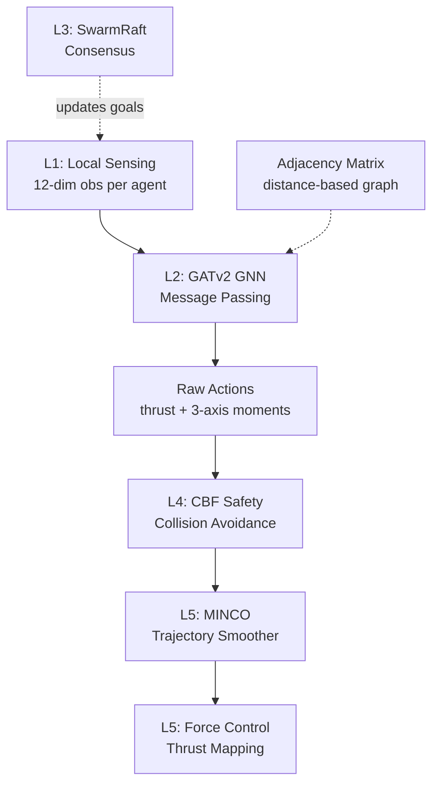
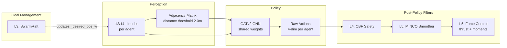

# Architecture: ggSwarm Decentralized Drone Coordination

## 1. Overview

ggSwarm is a decentralized formation control framework for UAV swarms, built on
NVIDIA Isaac Lab. It follows the **Graph Neural Swarm Control (GNSC)** 5-Layer model
with **Centralized Training, Decentralized Execution (CTDE)**.

## 2. GNSC 5-Layer Model

| Layer | Responsibility | Implementation |
| :--- | :--- | :--- |
| **L1: Local Sensing** | Per-agent state observation | `drone_swarm_env.py` — 12-dim obs (lin_vel, ang_vel, gravity, rel_pos_to_goal) |
| **L2: GNN Messaging** | Graph-based coordination | `skrl_gnn_policy.py` — GATv2Conv via PyTorch Geometric |
| **L3: Consensus** | Formation alignment + fault recovery | `swarm_raft.py` — heartbeat, leader election, slot redistribution |
| **L4: Safety Shield** | Collision avoidance | `cbf_safety.py` — pairwise Control Barrier Functions |
| **L5: Execution** | Trajectory smoothing + force control | `minco_trajectory.py` (EMA) + `drone_swarm_env.py` (thrust mapping) |

## 3. Data Flow

**Action contract:** The RL policy outputs `[thrust_cmd, moment_x, moment_y, moment_z]`
in `[-1, 1]`. Thrust is scaled by `thrust_to_weight * robot_weight`; moments by
`moment_scale` (0.01 Nm). Applied via `permanent_wrench_composer` — matches Isaac Lab's
`Isaac-Quadcopter-Direct-v0` reference.

## 4. Code Structure

### Environment Files

| File | Purpose |
| :--- | :--- |
| `drone_swarm_env.py` | MARL environment (scene, physics, obs, rewards, resets) |
| `drone_swarm_env_cfg.py` | Config classes: base, HoverStability, Formation, Perturbation, Phase3/4 |
| `contract_logic.py` | Pure-torch reward computation, adjacency matrix, curriculum alpha |
| `cbf_safety.py` | L4: CBF pairwise safety projection |
| `swarm_raft.py` | L3: SwarmRaft consensus and formation redistribution |
| `minco_trajectory.py` | L5: EMA trajectory smoother |

### Policy Files

| File | Purpose |
| :--- | :--- |
| `agents/skrl_gnn_policy.py` | GATv2 GNN policy (PyTorch Geometric + SKRL GaussianMixin) |
| `agents/skrl_mappo_cfg.yaml` | SKRL MAPPO hyperparameters |

### Scripts

| File | Purpose |
| :--- | :--- |
| `scripts/run.py` | Unified CLI: hover, phase2b, phase2c, phase3, debug |
| `scripts/skrl/train.py` | Training entry point |
| `scripts/skrl/play.py` | Evaluation / playback / video recording |
| `scripts/ggswarm_utils/sim_helpers.py` | GNN batched act patch, phase registry |

## 5. Platform

| Component | Technology |
| :--- | :--- |
| Simulation | NVIDIA Isaac Lab 2.3 / Isaac Sim 5.1 |
| RL Library | SKRL (MAPPO multi-agent) |
| Policy | GATv2Conv (PyTorch Geometric) |
| Optimizer | PPO with KL-adaptive learning rate |
| Robot | Bitcraze Crazyflie 2.x (~0.027 kg, 92mm motor-to-motor) |

---

## See Also

- [Phase 1: Foundation](../phases/phase1_foundation.md)
- [Phase 2: Brain Development](../phases/phase2_brain_development.md)
- [Phase 3: Muscle Refinement](../phases/phase3_muscle_refinement.md)
- [Tensor Shape Contracts](tensor_contracts.md)
- [Proposal](../project/proposal.md)
