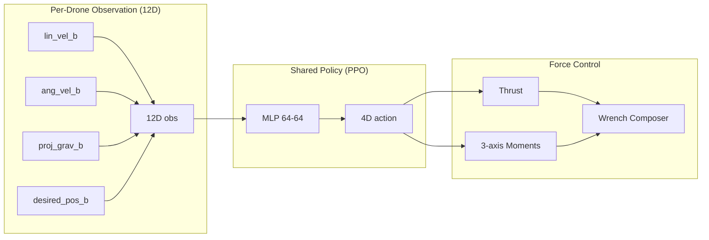

# Architecture: ggSwarm Decentralized Drone Coordination

## 1. Overview

ggSwarm is a decentralized formation control framework for UAV swarms, built on
NVIDIA Isaac Lab. It uses **Centralized Training, Decentralized Execution (CTDE)**
with a shared PPO policy trained across all drones simultaneously.

## 2. Current Architecture (Phase 2A)

**CTDE principle:** One policy network trains on all drones across all envs.
Each drone runs the same policy independently using only its local 12D observation.
No inter-drone communication needed for hover.

## 3. Action Contract

The RL policy outputs `[thrust_cmd, moment_x, moment_y, moment_z]` in `[-1, 1]`.

- Thrust: `thrust_to_weight * robot_weight * (action[0] + 1) / 2`
- Moments: `moment_scale * action[1:]` (0.01 Nm)
- Applied via `permanent_wrench_composer` — matches Isaac Lab's quadcopter reference

## 4. Code Structure

### Environment Files

| File | Purpose |
| :--- | :--- |
| `ggswarm_env.py` | `GgswarmEnv(DirectRLEnv)` — scene, physics, obs, rewards, resets |
| `ggswarm_env_cfg.py` | `GgswarmEnvCfg(DirectRLEnvCfg)` — all tunable parameters |

### Policy / Training

| File | Purpose |
| :--- | :--- |
| `agents/skrl_ppo_cfg.yaml` | SKRL PPO hyperparameters (quadcopter-proven) |
| `scripts/skrl/train.py` | Training entry point |
| `scripts/skrl/play.py` | Playback, video recording, trajectory plots |

### Visualization

| File | Purpose |
| :--- | :--- |
| `ggswarm/viz/trajectory_plots.py` | 2x2 trajectory summary (altitude, XY, attitude, distance) |
| `ggswarm/viz/nvenc_recorder.py` | NVENC H.264 video recording wrapper |

### Reference

| File | Purpose |
| :--- | :--- |
| `quadcopter_ref/quadcopter_env.py` | Isaac Lab quadcopter baseline (read-only reference) |
| `quadcopter_ref/agents/skrl_ppo_cfg.yaml` | Original quadcopter PPO config |

## 5. Platform

| Component | Technology |
| :--- | :--- |
| Simulation | NVIDIA Isaac Lab 2.3 / Isaac Sim 5.1 |
| RL Library | SKRL (single-agent PPO) |
| Policy | MLP [64, 64] with ELU (shared across all drones) |
| Optimizer | PPO with KL-adaptive learning rate |
| Robot | Bitcraze Crazyflie 2.x (~0.027 kg, 92mm motor-to-motor) |

## 6. Future Architecture (Phase 2B+)

Phase 2B will add multi-drone formation via a **SwarmWrapper** that:

1. Groups N consecutive envs into one "swarm"
2. Expands observations with relative neighbor positions
3. Adds formation rewards (inter-drone distance targets)
4. Optionally replaces MLP with GATv2 GNN policy

The physics stays 1-drone-per-env. The wrapper handles observation
expansion and formation reward computation.

---

## See Also

- [Phase 2: Brain Development](../phases/phase2_brain_development.md)
- [Tensor Shape Contracts](tensor_contracts.md)
- [Proposal](../project/proposal.md)
