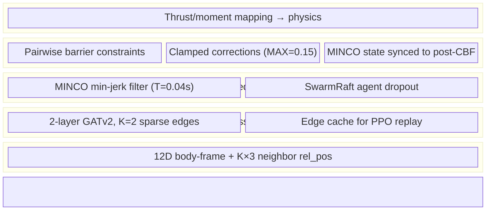
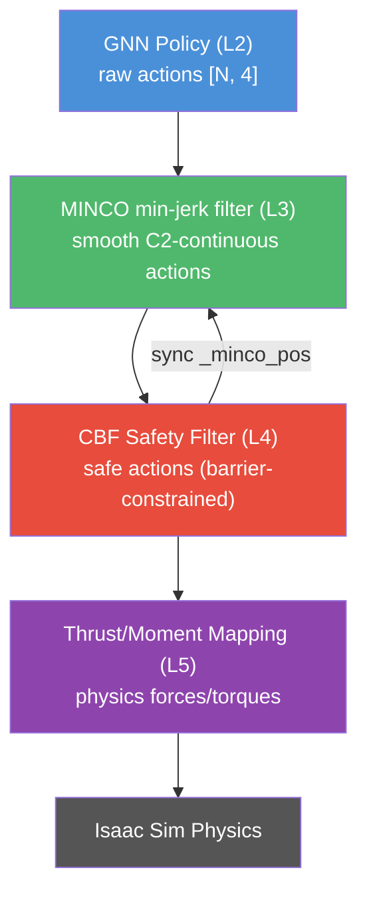
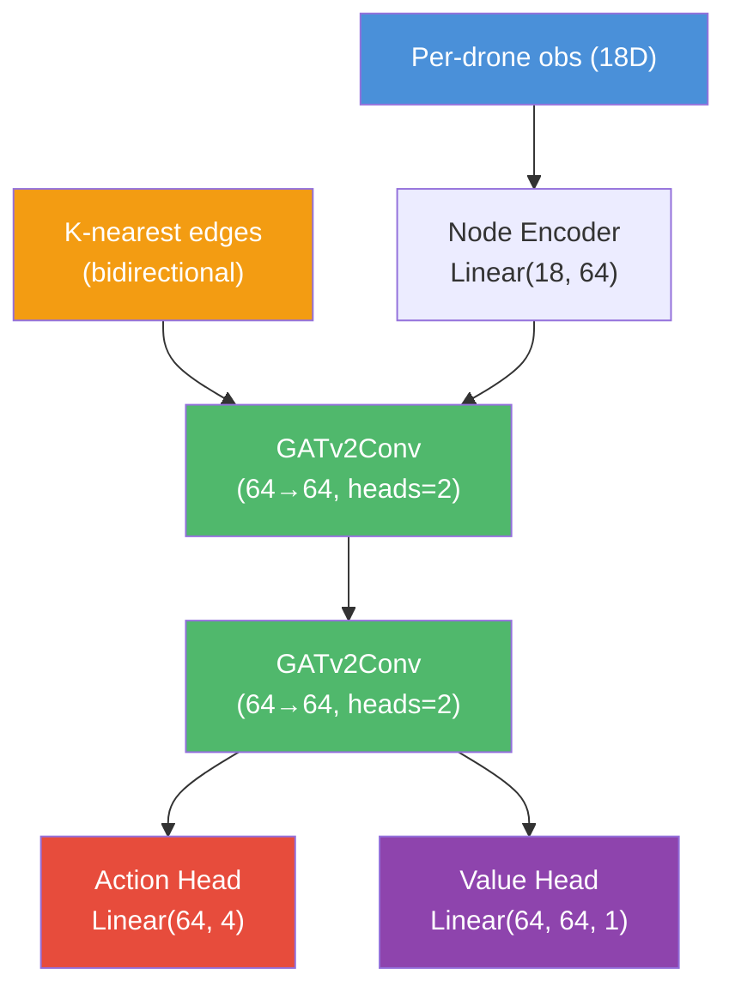
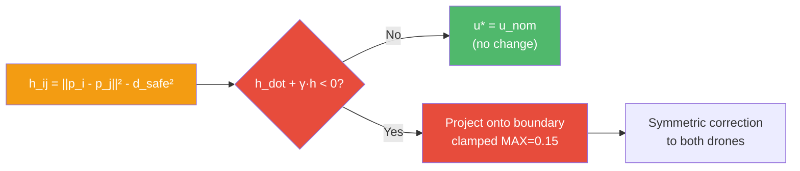
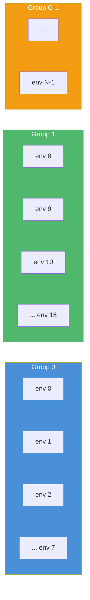

# Architecture: ggSwarm Decentralized Drone Coordination

## 1. Overview

ggSwarm is a decentralized formation control framework for UAV swarms, built on
NVIDIA Isaac Lab. It uses **Centralized Training, Decentralized Execution (CTDE)**
with a shared PPO policy trained across all drones simultaneously.

**Current state (Phase 3 complete):** 8-drone cloud formation with GATv2 GNN,
MINCO trajectory smoothing, CBF collision avoidance, SwarmRaft fault recovery,
and virtual collision detection.

## 2. GNSC 5-Layer Architecture

## 3. Action Pipeline

### Action Contract

The RL policy outputs `[thrust_cmd, moment_x, moment_y, moment_z]` in `[-1, 1]`.

- Thrust: `thrust_to_weight * robot_weight * (action[0] + 1) / 2`
- Moments: `moment_scale * action[1:]` (0.01 Nm)
- Applied via `permanent_wrench_composer`

## 4. Layer Details

### L1: Local Sensing

Each drone observes its own state (12D) plus K-nearest neighbor relative
positions (K*3D), for a total observation of 18D (K=2).

| Signal | Dim | Frame |
| :--- | :--- | :--- |
| `lin_vel_b` | 3 | Body |
| `ang_vel_b` | 3 | Body |
| `proj_grav_b` | 3 | Body |
| `desired_pos_b` | 3 | Body-relative |
| `neighbor_rel_pos` | K*3 | Local (env-origin subtracted) |

### L2: GATv2 GNN Policy

2-layer Graph Attention Network v2 with K=2 nearest neighbor sparse edges.

- Sparse KNN edges: 32 per group (A=8, K=2, bidirectional)
- Edge cache: circular buffer replays edges during PPO mini-batch update
- Dead drones excluded from KNN via alive mask (SwarmRaft)

**Key file:** `gnn_policy.py`

### L3: MINCO Minimum-Jerk Filter

Single-segment minimum-jerk (s=3) trajectory optimization. Computes the
unique 5th-order polynomial minimizing integral of squared jerk from
current state (pos, vel, acc) to GNN target over horizon T.

- Horizon: T=0.04s (2 env steps) — responsive enough for hover
- State: `_minco_pos`, `_minco_vel`, `_minco_acc` (pre-allocated [N, 4])
- Velocity/acceleration clamped for stability
- Supersedes EMA smoother (C2-continuous vs C0)

**Key file:** `minco.py`

### L3: SwarmRaft Agent Dropout

Simulated agent failure for fault recovery training.

- `_agent_alive [N]` boolean mask tracks live/dead status
- Random dropout at step 100-250 (configurable)
- Dead drones: actions zeroed, excluded from KNN/CBF/rewards/collisions
- Centroid computed from alive drones only
- Surviving drones' KNN topology self-heals (neighbors reconnect)

**Config:** `dropout_enabled`, `dropout_step_min/max`, `dropout_count`

### L4: CBF Safety Shield

QP-inspired Control Barrier Function for pairwise collision avoidance.

- Symmetric correction to both drones in pair
- Accepts alive_mask (skips dead drone pairs)
- MINCO state synced to post-CBF output (corrections are sticky)

**Config:** `cbf_enabled`, `cbf_d_safe = 0.30m`, `cbf_gamma = 2.0`
**Key file:** `cbf.py`

### Virtual Collision Detection

Pairwise distance check within swarm groups against `collision_radius=0.10m`.
Triggers collective group reset — hard training signal for separation learning.

### KNN-Based Cohesion

Cloud formation reward uses mean K-nearest neighbor distance (not centroid).
Scales to any swarm size. Merged with spacing penalty into single loop.

- Cohesion: `scale * (1 - tanh(mean_knn_dist / sigma))` per drone
- Separation penalty: linear penalty when nearest < `cloud_min_spacing`
- Spacing penalty: linear penalty when nearest > `cloud_max_neighbor_dist`

## 5. Swarm Grouping

One Crazyflie per env. N consecutive envs form a swarm group:

`N = num_envs (4096), A = num_agents (8), G = N/A (512 groups)`

- Observations expanded with neighbor positions within group
- Formation rewards computed within group
- Collective resets: if any alive drone in group dies, all reset
- Virtual collisions checked within group only

## 6. Code Structure

### Environment

| File | Purpose |
| :--- | :--- |
| `ggswarm_env.py` | `GgswarmEnv(DirectRLEnv)` — scene, physics, obs, rewards, resets, dropout |
| `ggswarm_env_cfg.py` | `GgswarmEnvCfg` — all tunable parameters |

### Post-Policy Filters

| File | Purpose |
| :--- | :--- |
| `minco.py` | MINCO minimum-jerk trajectory filter (L3) |
| `cbf.py` | CBF collision avoidance safety shield (L4) |

### Policy / Training

| File | Purpose |
| :--- | :--- |
| `gnn_policy.py` | GATv2 GNN policy with edge cache |
| `agents/skrl_ppo_cfg.yaml` | SKRL PPO hyperparameters |
| `scripts/skrl/train.py` | Training entry point |
| `scripts/skrl/play.py` | Playback, video, trajectory plots, KNN debug lines |

### Visualization

| File | Purpose |
| :--- | :--- |
| `viz/trajectory_plots.py` | 2x2 summary (altitude, XY, attitude, KNN distance) |
| `viz/nvenc_recorder.py` | NVENC H.264 video recording wrapper |

## 7. Platform

| Component | Technology |
| :--- | :--- |
| Simulation | NVIDIA Isaac Lab 2.3 / Isaac Sim 5.1 |
| RL Library | SKRL (single-agent PPO) |
| Policy | GATv2 GNN (2-layer, 64 hidden, K=2 edges) |
| Optimizer | PPO with KL-adaptive learning rate |
| Robot | Bitcraze Crazyflie 2.x (~0.027 kg, 92mm motor-to-motor) |
| Training | GCE NVIDIA L4 (24GB VRAM), 4096 envs |
| Play/Video | Local NVIDIA RTX 3070 (8GB VRAM) |

---

## See Also

- [Phase 3: Muscle Refinement](../phases/phase3_muscle_refinement.md)
- [Phase 4: Stress Testing](../phases/phase4_stress_testing.md)
- [Tensor Shape Contracts](tensor_contracts.md)
- [Proposal](../project/proposal.md)
