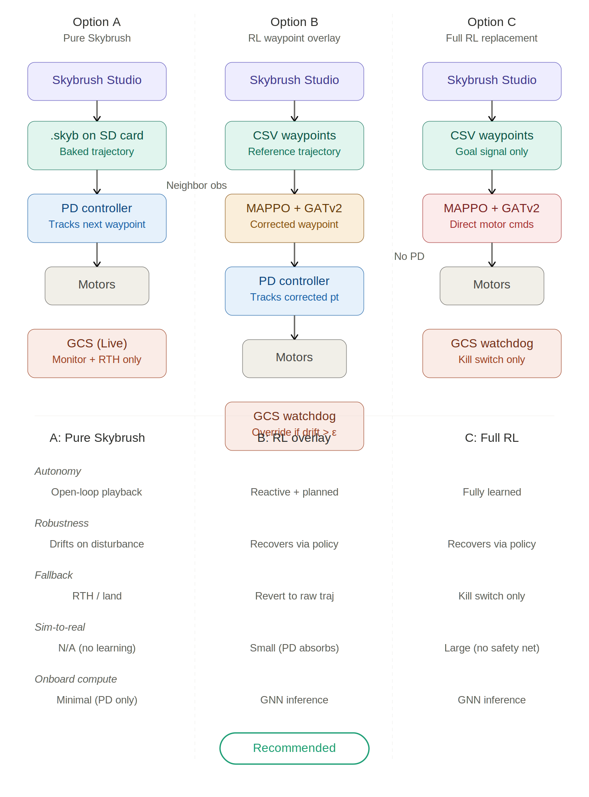
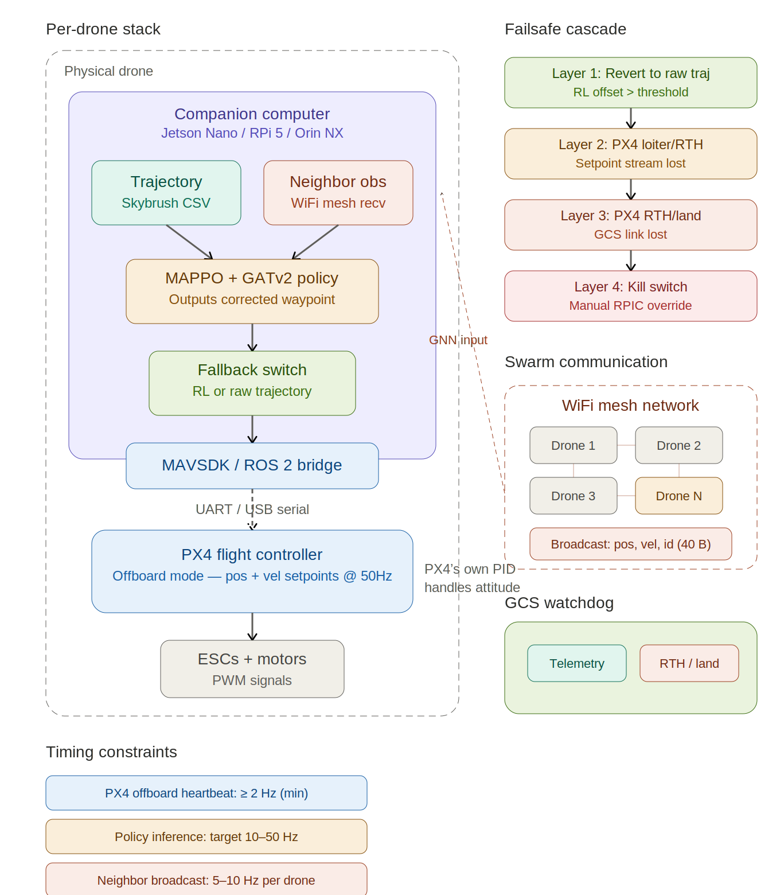

# System Architecture Document

## ggSwarm + Skybrush Integration — Option B: RL Waypoint Overlay on PX4

**Multi-Agent Drone Swarm with Adaptive Trajectory Execution**

Gary Kuepper — KOZ Enterprises
Long Beach, California
DRAFT — April 2026

---

## 1. Introduction

This document describes the system architecture for integrating Skybrush drone show choreography with the ggSwarm multi-agent reinforcement learning (RL) execution engine, deployed on PX4-based flight hardware. The architecture follows Option B: RL Waypoint Overlay, selected after evaluating three candidate approaches.

### 1.1 Design philosophy

The system is designed around three core principles:

- **Choreography-first:** Skybrush Studio provides the artistic trajectory design, validated for safety constraints before any drone leaves the ground.
- **Adaptive execution:** The trained MAPPO/GATv2 policy enhances trajectory following by compensating for disturbances and maintaining formation coherence, but never overrides the fundamental choreography.
- **Graceful degradation:** At every layer, failure results in a simpler but still safe operating mode. The system never transitions from "working" to "catastrophic" in a single step.

### 1.2 Scope

This document covers the end-to-end pipeline from show design in Skybrush Studio through real-time execution on PX4 hardware, including the RL policy integration, inter-drone communication, failsafe architecture, and ground control station interfaces.

---

## 2. Architecture options evaluated

Three candidate architectures were evaluated for integrating Skybrush choreography with ggSwarm RL execution. The following diagram compares them side by side.

*Figure 1: Architecture options comparison — Option A (pure Skybrush), Option B (RL overlay), Option C (full RL replacement)*

### 2.1 Option A: Pure Skybrush

Drones play back baked trajectories from .skyb files on the flight controller's SD card. A PD controller tracks each waypoint. Simple and proven, but provides zero adaptive capability — drones drift off-path under disturbances with no recovery mechanism.

### 2.2 Option B: RL waypoint overlay (selected)

Skybrush CSV waypoints serve as reference trajectories. The trained MAPPO/GATv2 policy runs on a companion computer and outputs corrected waypoints fed to PX4's position controller via offboard mode. The PD controller still handles low-level tracking. If the RL correction exceeds a threshold, the system reverts to raw Skybrush waypoints automatically.

**This option was selected** because it provides adaptive formation control while maintaining multiple independent fallback layers. The sim-to-real gap is minimized because PX4's PID absorbs model mismatch.

### 2.3 Option C: Full RL replacement

The RL policy outputs motor commands directly, bypassing PX4's position controller. Rejected due to no PD safety net, larger sim-to-real gap, and the requirement for GNN inference at ~100 Hz attitude-control rates.

---

## 3. Selected architecture: Option B on PX4

The following diagram shows the full per-drone hardware and software stack for Option B deployed on PX4, including the failsafe cascade and inter-drone communication layer.

*Figure 2: Option B per-drone stack on PX4 with failsafe cascade and swarm communication*

### 3.1 Skybrush choreography pipeline

The show design pipeline flows from artistic concept to per-drone trajectory files:

1. **Design:** Formations and transitions are choreographed in Skybrush Studio (Blender addon) with real-time safety validation for velocity, altitude, and proximity constraints.
2. **Export:** The show is exported as a CSV ZIP file containing one CSV per drone with columns: time (ms), X, Y, Z (meters), R, G, B (0–255). Trajectory sampling at 4–5 fps.
3. **Validation:** Skybrush Viewer provides 3D visualization with trajectory validation charts. A PDF validation report is generated for flight authority review.
4. **Deployment:** CSV files are loaded onto each drone's companion computer storage prior to flight.

### 3.2 Companion computer software stack

The companion computer (Jetson Orin NX, Jetson Nano, or Raspberry Pi 5) runs the following pipeline at 10–50 Hz:

| Module | Rate | Description |
|--------|------|-------------|
| **Trajectory loader** | Per-frame | Reads Skybrush CSV, interpolates reference waypoint. Maintains 3–5 waypoint lookahead buffer. |
| **Neighbor receiver** | 5–10 Hz | Listens for UDP broadcast state packets. Assembles GATv2 adjacency graph from packets within last 200 ms. |
| **RL policy** | 10–50 Hz | MAPPO + GATv2 (GNSC 5-layer) inference. Output: position offset from reference trajectory. |
| **Fallback switch** | Per-frame | Monitors RL offset magnitude. If > threshold (default 2 m), bypasses RL. Logs event. |
| **Setpoint publisher** | ≥50 Hz | Publishes position + velocity setpoints to PX4 via MAVSDK/ROS 2 over UART. |
| **State broadcaster** | 5–10 Hz | Broadcasts own state via UDP to WiFi mesh for other drones' GNN inputs. ~40 bytes. |

### 3.3 PX4 offboard mode integration

PX4 operates in offboard mode throughout the show. The companion computer provides position and velocity setpoints via MAVLink `SET_POSITION_TARGET_LOCAL_NED` or ROS 2 `TrajectorySetpoint`. Key parameters:

| Parameter | Value | Purpose |
|-----------|-------|---------|
| `COM_OF_LOSS_T` | 1.0 s | Timeout before exiting offboard mode if setpoints stop |
| `COM_OBL_RC_ACT` | Position Hold | Action on offboard loss |
| `NAV_DLL_ACT` | RTH then Land | Action on GCS data link loss |
| `COM_RC_IN_MODE` | 4 (disabled) | No RC stick input (swarm uses automated control) |
| `GF_ACTION` | RTH | Geofence violation triggers return to home |
| `COM_RC_OVERRIDE` | Enabled | Dedicated RC can override to Position mode for RPIC takeover |

PX4's internal PID position and attitude controllers handle all low-level stabilization. The companion computer only provides position-level guidance, ensuring PX4's extensively tested flight dynamics remain in the loop at all times.

### 3.4 Inter-drone communication

Each drone broadcasts a compact UDP packet at 5–10 Hz containing position, velocity, and drone ID (~40 bytes). The GNN adjacency graph is constructed from drones heard within 200 ms. If the mesh degrades or fails entirely, drones gracefully degrade to independent trajectory following — the GNN receives zero-neighbor observations and the policy output converges to minimal correction.

**Critical design decision:** The WiFi mesh is not flight-critical infrastructure. It improves swarm coordination but is not required for any individual drone's safe flight, eliminating it as a single point of failure for the swarm.

---

## 4. Failsafe architecture

Four independent failsafe layers, each progressively more aggressive. Each layer operates without dependency on any layer above it. No single component failure can bypass more than one layer.

| Layer | Name | Trigger | Action | Runs on |
|-------|------|---------|--------|---------|
| 1 | **RL fallback** | RL offset > threshold | Revert to raw Skybrush waypoint | Companion computer |
| 2 | **Offboard timeout** | Setpoint stream stops > 1 s | PX4 Position Hold / RTH | PX4 firmware (independent) |
| 3 | **Data link loss** | GCS heartbeat lost > 10 s | PX4 RTH then land | PX4 firmware (independent) |
| 4 | **Kill switch** | RPIC manual activation | Motor disarm / fleet land | Dedicated RC link (independent) |

**Independence guarantee:** Layer 2 activates even if the companion computer has suffered a complete hardware failure (PX4 detects missing setpoints at firmware level). Layer 3 activates independently of Layers 1 and 2 (PX4 monitors GCS heartbeat separately). Layer 4 operates on a dedicated 900 MHz RC link, independent of the WiFi network used for all other communication.

---

## 5. RL policy architecture

### 5.1 Policy network

- **Algorithm:** MAPPO (Multi-Agent Proximal Policy Optimization)
- **Graph neural network:** GATv2 with 5 message-passing layers (GNSC architecture)
- **Training environment:** NVIDIA Isaac Lab with Crazyflie 2.1 drone models
- **Training framework:** SKRL library
- **Deployment format:** ONNX or TorchScript export for companion computer inference

### 5.2 Observation space

The policy observation vector includes:

- **Own state:** Position, velocity, orientation (from PX4 EKF2 state estimate)
- **Reference trajectory:** Next 3–5 Skybrush waypoints as relative offsets from current position, with time-to-arrival for each
- **Neighbor states:** Relative positions and velocities of drones heard on WiFi mesh (variable-length, handled by GATv2 attention)

### 5.3 Action space

The policy outputs a 3D position offset (dx, dy, dz) from the current Skybrush reference waypoint, clamped to a maximum correction radius (configurable, default 2 m). The corrected waypoint = reference waypoint + policy offset. This is fed to PX4 as a position setpoint with velocity feedforward computed from the trajectory's time derivative.

### 5.4 Reward function

The reward function combines:

- **Trajectory tracking:** Negative L2 distance to Skybrush reference waypoint at each timestep
- **Temporal tracking:** Penalty for being ahead of or behind schedule relative to CSV timestamps
- **Collision avoidance:** Large penalty for inter-drone distance below minimum separation threshold
- **Smoothness:** Penalty for large velocity changes (jerk minimization)
- **Formation coherence:** Reward for maintaining correct relative positions to neighbors as defined by the Skybrush choreography

---

## 6. FAA Part 107.35 waiver alignment

This architecture is designed to support a Part 107.35 waiver application for operating multiple sUAS simultaneously. Key safety properties:

- **No single point of failure:** Each drone's flight safety is self-contained. No shared component failure can cause loss of control of multiple aircraft.
- **Positive control maintained:** PX4's firmware-level failsafes ensure the drone always has a defined safe behavior, even if every software layer above PX4 fails.
- **Pre-validated trajectories:** Skybrush's proximity, velocity, and altitude validation runs before flight, providing a proven-safe baseline that the RL policy can only improve upon.
- **Simulation evidence:** Isaac Lab training logs, TensorBoard metrics, and formal scorecard gates provide documented evidence of system validation across thousands of simulated scenarios.
- **Graceful degradation:** Every failure mode results in a simpler but still safe operating state. The system never goes from nominal to catastrophic in one step.

See companion document **ggSwarm Safety Case Outline** for detailed hazard identification, risk mitigation matrix, and operational procedures formatted for the FAA Waiver Safety Explanation guidelines.

---

## Revision history

| Version | Date | Author | Changes |
|---------|------|--------|---------|
| 0.1 | April 2026 | Gary Kuepper | Initial draft |
