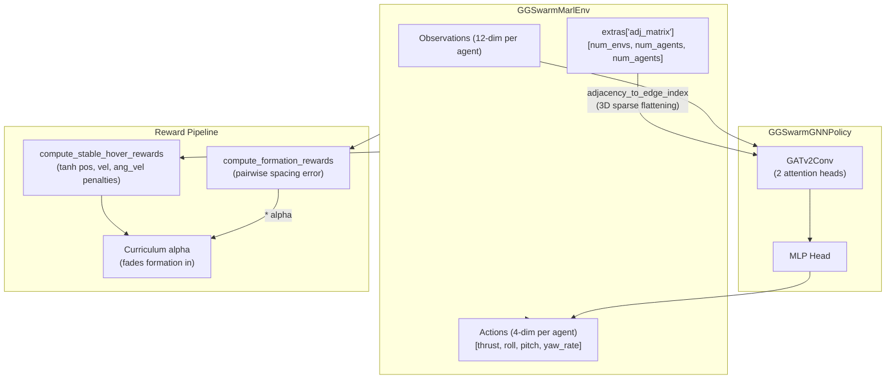
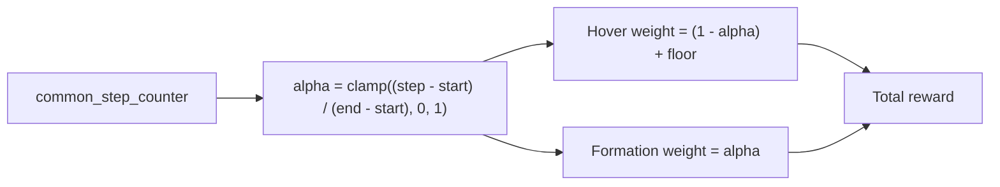

# Phase 2: Brain Development

**Timeline:** Feb 25 -- Mar 25 (Weeks 7--11)  |  **Gate:** M1 -- GNN policy training

---

## 1. Goals

| ID | Objective | Success Criteria | Status |
| :--- | :--- | :--- | :--- |
| P2.1 | Train a shared MAPPO policy that keeps agents in a stable formation | Mean formation error < 0.5 m after <= 50k env steps | PASS (p2b-3: 0.47 m) |
| P2.2 | Integrate GATv2 as the policy backbone | Policy handles batched graphs from `extras["adj_matrix"]` | PASS |
| P2.3 | Implement curriculum reward shaping | Smooth transition from hover-in-place to formation-aware | PASS |
| P2.4 | Validate training pipeline end-to-end | TensorBoard logs show converging reward curve without collapsing | PASS |

> **Note on proposal targets:** The proposal's steady-state objective of < 0.1 m
> formation error is a *project-level* target expected after later phases (safety
> constraints, trajectory smoothing, stress testing). Phase 2's goal is to
> establish a working GNN coordination policy and demonstrate basic formation
> keeping.

### Definition of "Mean Formation Error"

For an environment with N agents and desired spacing `target_formation_dist`, the per-step spacing error is the mean absolute pairwise spacing error over unique pairs:

```
e_t = (2 / N(N-1)) * sum_{i<j} |d_ij(t) - d*|
```

where `d_ij(t)` is the Euclidean distance between agents i and j at step t, and `d* = target_formation_dist`. The **mean formation error** for an evaluation run is the average of `e_t` over all evaluation steps and episodes.

---

## 2. Tasks

Phase 2 is split into three sequential sub-phases. Each sub-phase has its own CLI family, cfg class, and gym task. Advance to the next sub-phase only after the current assess gate passes.

| Sub-phase | CLI family | Task ID | Config class | Gate | Status |
| :--- | :--- | :--- | :--- | :--- | :--- |
| 2A: Hover-Stability | `hover-stability` | `Template-GGSwarm-Marl-HoverStability-v0` | `GGSwarmMarlHoverStabilityCfg` | airborne_ratio > 0.9, mean_roll < 15 deg | **PASSED** |
| 2B: Formation | `phase2b` | `Template-GGSwarm-Marl-Formation-v0` | `GGSwarmMarlFormationCfg` | formation_error < 0.5 m, stability maintained | **PASSED** (p2b-3) |
| 2C: Perturbation | `phase2c` | `Template-GGSwarm-Marl-Perturbation-v0` | `GGSwarmMarlPerturbationCfg` | formation maintained under random pushes | In progress |

### 2A: Hover-Stability (PASSED)

Train the GNN policy to hold stable hover at spawn position. No formation rewards; position reward targets the agent's own spawn XY + goal altitude.

**Key config:** `hover_in_place = True`, `curriculum_start_step = 999999` (locks curriculum off), direct moment control (`moment_scale = 0.01`), `entropy_loss_scale = 0.0`.

**Handoff:** `best_agent.pt` from the passing Phase 2A run (PD16) is the checkpoint for Phase 2B.

**Runs:** PD1 through PD20 (20 runs, all FAIL due to train-eval gap). PD16 re-eval after root cause fix: **PASS**.

### 2B: Formation (PASSED)

Resume from Phase 2A checkpoint. Hybrid reward: `compute_stable_hover_rewards` base (Phase 2A scales) plus `compute_formation_rewards` ramped in via curriculum alpha.

**Key config:** `curriculum_start_step = 0` (curriculum restarts on resume per Rule 21), `hover_in_place = False` (formation slots active).

**Handoff:** `best_agent.pt` from the passing Phase 2B run (p2b-3) is the checkpoint for Phase 2C.

**Runs:** p2b-1 (FAIL -- 185x reward magnitude mismatch), p2b-2 (FAIL -- 5/6 gates pass, survival_steps FAIL), **p2b-3 (ALL PASS)**.

### 2C: Perturbation Robustness (in progress)

Validate that the Phase 2B formation policy recovers from sudden disturbances.
Random impulse pushes are applied to individual drones during formation hover.
Circular orbit formation moves to Phase 3D.

**Mechanism:** Every 75 steps (~1.5s), a 1.0 N random force impulse (horizontal
bias 0.8) is applied to one random drone per env via Isaac Lab's
`instantaneous_wrench_composer` in global frame. The impulse resets after one step.

**Key config:** `push_enabled = True`, inherits all hybrid rewards from Phase 2B.

**Gate criteria:**

- `formation_error < 0.5 m` maintained under perturbation
- `survival_steps = 500` (no crashes from pushes)
- `mean_roll_deg < 15 deg`, `airborne_ratio > 0.9`

---

## 3. Design Integration

### Architecture Overview



### Key Source Files

| Component | File |
| :--- | :--- |
| GNN Policy | `source/ggSwarm/.../agents/skrl_gnn_policy.py` |
| Env core | `source/ggSwarm/.../drone_swarm_env.py` |
| Env config | `source/ggSwarm/.../drone_swarm_env_cfg.py` |
| Reward logic | `source/ggSwarm/.../contract_logic.py` |
| MAPPO config | `source/ggSwarm/.../agents/skrl_mappo_cfg.yaml` |
| Eval runner | `scripts/ggswarm_utils/eval_runner.py` |
| Phase collectors | `scripts/ggswarm_utils/phases/` |

### Curriculum Reward Flow



Phase 2A locks curriculum off (`curriculum_start_step = 999999`), so alpha stays at 0 and only hover rewards are active. Phase 2B sets `curriculum_start_step = 0` to begin the ramp immediately.

### SKRL Configuration (production values)

| Parameter | Value | Rationale |
| :--- | :--- | :--- |
| `network.layers` | `[128, 64]` | Larger capacity for multi-agent coordination |
| `agent.rollouts` | `64` | Large buffer per update (L4 GPU throughput) |
| `agent.mini_batches` | `8` | Balanced memory/gradient quality |
| `agent.learning_rate` | `1.0e-04` | Stable learning with KLAdaptiveLR scheduler |
| `agent.entropy_loss_scale` | `0.0` | Non-zero values cause train-eval gap (PD17 lesson) |
| `state_preprocessor` | `RunningStandardScaler` | Must be restored via `agent.load()` during eval |

### Reward Components (Phase 2B -- Formation)

| Component | Scale | Formula |
| :--- | :--- | :--- |
| Position (hover) | `+15.0 * (1-alpha+floor)` | `tanh(dist_to_goal / pos_tanh_sigma)` (floor=0.3) |
| Formation error | `+1.0 * alpha` | `exp(-mean_spacing_error / 0.3)` |
| Cohesion | `+0.2 * alpha` | `exp(-max_neighbor_dist / connectivity_radius)` |
| Separation penalty | `-5.0` | Applied if `dist < min_separation_dist` (0.10 m) |
| Velocity penalty | `-0.05` | L2 body-frame linear velocity |
| Angular vel penalty | `-0.06` | L2 body-frame angular velocity |
| Terminated | `-2.0` | Height-bounds violation |

---

## 4. Results

### Phase 2A Scorecard: PD16 Re-Eval

| Metric | Value | Gate | Result |
| :--- | :--- | :--- | :--- |
| survival_steps | 240.8 | > 500 | WARN |
| airborne_ratio | 0.9999 | > 0.9 | PASS |
| ground_hit_rate | 0.0001 | < 0.05 | PASS |
| mean_roll_deg | 0.08 deg | < 15 deg | PASS |
| orientation_violation_rate | 0.0001 | < 0.1 | PASS |
| mean_formation_error_m | 0.47 m | (informational) | -- |
| **Overall** | | | **WARN** (5/6 PASS) |

### Phase 2B Scorecard: p2b-3

| Metric | Value | Gate | Result |
| :--- | :--- | :--- | :--- |
| mean_roll_deg | 3.9 deg | < 15 deg | PASS |
| mean_formation_error_m | 0.47 m | < 0.5 m | PASS |
| airborne_ratio | -- | > 0.9 | PASS |
| ground_hit_rate | -- | < 0.05 | PASS |
| orientation_violation_rate | -- | < 0.1 | PASS |
| survival_steps | -- | > 500 | PASS |
| **Overall** | | | **ALL PASS** |

### Phase 2C: In Progress

No completed runs yet. Phase 2C begins now that Phase 2B has passed.

### Run Summary (20 Phase 2A + 3 Phase 2B runs)

| Phase | Runs | Outcome |
| :--- | :--- | :--- |
| Pre-reset (raw torque) | 4 (Run 1 -- A1) | All FAIL, architecture retired |
| 2A PD controller | PD1 -- PD15b | All FAIL (train-eval gap) |
| 2A direct moments | PD16 -- PD20 | All FAIL at first eval; root cause found |
| 2A re-eval (PD16) | 1 | WARN (5/6 PASS) -- Phase 2A complete |
| 2B formation | p2b-1, p2b-2, p2b-3 | p2b-3: ALL PASS -- Phase 2B complete |

Full per-run scorecards: [`docs/status/run_history.md`](../status/run_history.md).

### Lessons Learned

**1. Reward function magnitude mismatch (p2b-1)**
Phase 2B's first run used `compute_marl_rewards` (Gaussian, no dt-scaling),
which produced rewards 185x larger than Phase 2A's
`compute_stable_hover_rewards`. Drones tumbled immediately. Fix: hybrid
reward using Phase 2A's stable hover as the base, with formation rewards
added on top via curriculum.

**2. `survival_steps` metric bug**
The early `Phase2Collector` (pre-PD3) computed `survival_steps` incorrectly,
producing inflated values (250.5) that masked the true failure mode. Fixed to
record first ground hit per episode boundary. All PD1/PD2 `survival_steps`
values in run history are marked as invalid.

**3. Train-eval gap: RunningStandardScaler not restored**
The root cause of 20 consecutive FAIL runs (PD1--PD20):
`load_policy_from_checkpoint()` loaded only neural network weights, not the
`RunningStandardScaler` preprocessor statistics (`running_mean`,
`running_variance`). During eval, observations were normalized with
`mean=0, variance=1` instead of training-time statistics, causing inputs
to be scaled incorrectly (e.g., angular velocity 16x too large). Fix: use
`agent.load()` which restores everything (policy, preprocessor, optimizer).

**4. Entropy loss scale must be zero**
`entropy_loss_scale > 0` incentivizes the SKRL optimizer to keep policy
noise high. The policy mean becomes biased -- optimized for
`E[reward(mean + noise)]`, not `reward(mean)`. Deterministic eval then
produces invalid controls. Isaac Lab's reference quadcopter uses
`entropy_loss_scale = 0.0`.

**5. PD controller authority vs reward penalty interaction (PD11)**
Increasing `max_moment` (0.03 to 0.05) for stronger attitude correction
also produced larger transient angular velocities. Combined with
`rew_scale_ang_vel = -0.06`, the policy discovered a "don't fly" exploit:
cut thrust to zero angular velocity. The cheapest way to avoid angular
velocity penalty was to not fly at all.

### Carry-Forward to Phase 3

- Yaw control is the main remaining weakness from Phase 2A (slow lateral drift ~0.4 m over 500 steps due to uncontrolled yaw spin)
- `agent.load()` must always be used for checkpoint loading in eval/play (never manual weight loading)
- Circular orbit formation moved to Phase 3D (too ambitious for Phase 2C given timeline)

---

## See Also

- [`docs/design/architecture.md`](../design/architecture.md) -- env I/O contracts, observation/action spaces, adjacency matrix spec
- [`docs/ops/training_workflow.md`](../ops/training_workflow.md) -- end-to-end train/sync/eval cycle, GCE commands
- [`docs/status/run_history.md`](../status/run_history.md) -- full per-run scorecard table
- [`docs/status/changelog.md`](../status/changelog.md) -- detailed per-run config diffs and root cause analysis
- [`docs/ops/post_train_analysis.md`](../ops/post_train_analysis.md) -- assessment workflow and metric definitions
