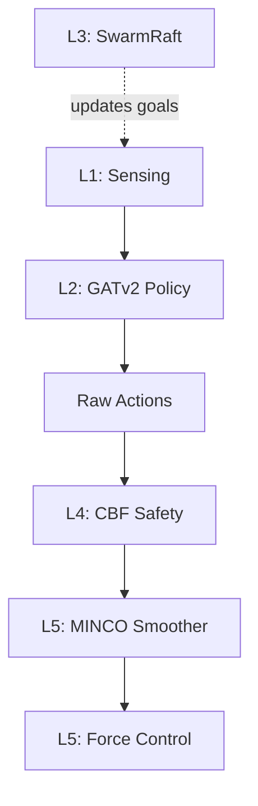

# Phase 3: Muscle Refinement

**Timeline:** Mar 25 -- Apr 7 (Weeks 12--13)  |  **Gate:** M2 — Logic integration complete by Apr 7

---

## 1. Goals

Phase 3 adds the remaining GNSC layers on top of the Phase 2 GATv2 policy:
**L4 CBF Safety Shield**, **L3 SwarmRaft Consensus**, and **L5 MINCO Trajectory
Smoother**. It also introduces circular orbit formation (promoted from Phase 2C).
All components are post-policy filters or goal managers --- they do **not** require
retraining the Phase 2 checkpoint and are individually config-gated so the Phase 2
path is unaffected.

| ID | Objective | Success Criteria |
| :--- | :--- | :--- |
| P3.1 | Hard inter-agent collision avoidance via CBF | **Zero** collision events across 10 evaluation episodes |
| P3.2 | Autonomous gap-filling after agent loss via SwarmRaft | Formation re-syncs within **2.0 s** of a simulated failure |
| P3.3 | Velocity jitter reduction via MINCO smoother | **>= 20%** reduction in `std(\|\|lin_vel\|\|)` vs. Phase 2 baseline |
| P3.4 | Steady-state formation error maintained or improved | Mean formation error **< 0.5 m** (Phase 2 criterion maintained) |

> **Proposal project-level targets** (< 0.1 m formation error, 0 collisions, 2 s recovery)
> are the *cumulative* outcome expected after Phase 3 + Phase 4 stress testing.
> Phase 3 establishes the mechanisms; Phase 4 validates them at scale.

---

## 2. Tasks

### Phase 3A: CBF Safety Shield (L4) — Collision Avoidance

**Goal:** Guarantee zero inter-agent collisions via a Control Barrier Function that
projects unsafe actions onto the safe half-space.

**CBF formulation:**

```
h_ij(x) = ||p_i - p_j||^2 - d_safe^2
```

When `h_ij` approaches zero the raw action for agent `i` is projected:

```
a_safe = a_raw - min(0, (nabla_h . a_raw + gamma * h) / ||nabla_h||^2) * nabla_h
```

where `gamma` is the barrier decay rate (`cbf_gamma`). Only the thrust component
(action dim 0) is corrected since it dominates horizontal velocity; moment corrections
are applied proportionally if the barrier is critically violated. No QP solver is
required for pairwise spherical constraints.

**Config parameters (`GGSwarmMarlEnvCfg`):**

| Parameter | Default | Description |
| :--- | :--- | :--- |
| `cbf_enabled` | `False` | Toggle CBF; `False` preserves Phase 2 behavior |
| `cbf_d_safe` | `0.12` | Safe separation distance (m), slightly above `min_separation_dist` |
| `cbf_gamma` | `1.0` | Barrier decay rate |
| `rew_scale_cbf_intervention` | `0.0` | Set negative to penalize CBF reliance |

**Tensor shapes:**

| Tensor | Shape |
| :--- | :--- |
| `actions` (input/output) | `[num_envs, num_agents, 4]` |
| `pos_w` | `[num_envs, num_agents, 3]` |
| `lin_vel_w` | `[num_envs, num_agents, 3]` |
| `cbf_intervention_mask` | `[num_envs, num_agents]` bool |

**Deliverables:**

- `ggswarm_marl/cbf_safety.py` — pure-torch, no Isaac Lab imports, unit-testable
- Integration into `_pre_physics_step` behind `cbf_enabled` flag
- `cbf_intervention_rate` logged to `extras["log"]`

---

### Phase 3B: SwarmRaft Consensus (L3) — Agent Loss Recovery

**Goal:** Detect agent loss and autonomously redistribute formation slots so the
remaining agents fill the gap.

**Design:**

1. **Heartbeat:** Each alive agent resets a counter each step. Missing heartbeats
   (counter exceeds `raft_heartbeat_timeout`) flag the agent as lost.
2. **Leader election:** Deterministic --- the lowest-index alive agent per environment
   is the leader. No message rounds needed; the simulation's shared tensor makes
   this instantaneous and split-brain-free.
3. **Formation redistribution:** Leader recomputes circular formation slots for the
   remaining alive agents using the same chord-length formula as `_reset_idx`, then
   writes new targets into `_desired_pos_w`.
4. **Cooldown:** A `raft_replan_cooldown` guard prevents thrashing when multiple
   agents are lost in quick succession.

**Config parameters (`GGSwarmMarlEnvCfg`):**

| Parameter | Default | Description |
| :--- | :--- | :--- |
| `raft_enabled` | `False` | Toggle SwarmRaft; `False` preserves Phase 2 behavior |
| `raft_tick_interval` | `10` | Physics steps between SwarmRaft ticks |
| `raft_heartbeat_timeout` | `50` | Steps before declaring agent lost |
| `raft_replan_cooldown` | `100` | Min steps between formation replans |

**Observation space expansion (when `raft_enabled = True`):**

| Dim | Meaning |
| :--- | :--- |
| 13 | `is_leader` --- 1.0 if this agent is the current leader, else 0.0 |
| 14 | `num_alive_frac` --- fraction of original agents still alive (0--1) |

To preserve Phase 2 checkpoint compatibility, the obs expansion is only active when
`raft_enabled = True`. A new registration `Template-GGSwarm-Marl-Phase3-v0` uses
14-dim obs for Phase 3 runs.

**Tensor shapes:**

| Tensor | Shape |
| :--- | :--- |
| `heartbeat` | `[num_envs, num_agents]` int |
| `agent_alive` | `[num_envs, num_agents]` bool |
| `raft_replan_counter` | `[num_envs]` int |

**Deliverables:**

- `ggswarm_marl/swarm_raft.py` — pure-torch, no Isaac Lab imports, unit-testable
- Integration into `_get_observations` gated by `raft_enabled`
- `scripts/run.py phase3 train/play/eval` commands

> **Scope-cut note (CLAUDE.md):** If Phase 3 overruns, nearest-alive-slot fallback
> replaces the full Raft state machine.

---

### Phase 3C: MINCO Trajectory Smoother (L5) — Jitter Reduction

**Goal:** Reduce velocity jitter by smoothing raw policy actions with a causal
exponential moving average (EMA).

**EMA formulation:**

```
a_smooth[t] = alpha * a_raw[t] + (1 - alpha) * a_smooth[t-1]
```

where `alpha = minco_smoothing_alpha` (lower = more smoothing). This is the MVP
implementation. The buffer also stores position history to enable an upgrade to a
true minimum-snap polynomial fit (5th-order) once EMA is validated.

**Config parameters (`GGSwarmMarlEnvCfg`):**

| Parameter | Default | Description |
| :--- | :--- | :--- |
| `minco_enabled` | `False` | Toggle MINCO; `False` preserves Phase 2 behavior |
| `minco_buffer_size` | `5` | Action history window (for polynomial upgrade) |
| `minco_smoothing_alpha` | `0.3` | EMA coefficient (lower = smoother) |

**Tensor shapes:**

| Tensor | Shape |
| :--- | :--- |
| `action_buffer` | `[num_envs, num_agents, buffer_size, 4]` |
| `smooth_actions` (output) | `[num_envs, num_agents, 4]` |

**Deliverables:**

- `ggswarm_marl/minco_trajectory.py` — pure-torch, no Isaac Lab imports, unit-testable
- Integration into `_pre_physics_step` after CBF, behind `minco_enabled` flag
- Buffer reset on env reset in `_reset_idx`

> **Scope-cut note (CLAUDE.md):** If Phase 3 overruns, drop MINCO polynomial upgrade;
> EMA smoother (`alpha=0.3`) is the shipped implementation.

---

### Phase 3D: Circular Orbit Formation

**Goal:** Drones maintain a horizontal circular formation while orbiting a center
point. Promoted from Phase 2C planning into Phase 3 implementation.

This builds on the static circular formation from Phase 2B by adding angular velocity
targets so drones continuously orbit rather than hover at fixed slots. SwarmRaft
(Phase 3B) handles slot redistribution if an agent is lost during orbit.

---

## 3. Design Integration

### Data Flow (Phase 3)



### New Files

| File | Layer | Purpose |
| :--- | :--- | :--- |
| `ggswarm_marl/cbf_safety.py` | L4 | Pairwise CBF barriers + analytical projection |
| `ggswarm_marl/swarm_raft.py` | L3 | Heartbeat detection, leader election, formation redistribution |
| `ggswarm_marl/minco_trajectory.py` | L5 | EMA action smoother (MVP); polynomial upgrade path |
| `scripts/eval_phase3.py` | --- | Phase 3 evaluation script |

All three new modules are **pure-torch** with no Isaac Lab imports (same pattern as
`contract_logic.py`) so they are unit-testable in isolation.

### Integration Points in `drone_swarm_env.py`

CBF and MINCO integrate into `_pre_physics_step`, between action stacking and thrust
mapping:

```python
if self.cfg.cbf_enabled:
    all_actions, cbf_rate = apply_cbf_safety(
        all_actions, pos_w, lin_vel_w, self.cfg
    )
    self.extras["log"]["cbf_intervention_rate"] = cbf_rate

if self.cfg.minco_enabled:
    all_actions = self._minco.smooth(all_actions)
```

SwarmRaft integrates into `_get_observations`, appending leader/alive dims when
`raft_enabled = True`.

### Evaluation Metrics

| Metric | Target | Maps to |
| :--- | :--- | :--- |
| Collision rate (events/episode) | **0** | P3.1 |
| Gap-fill latency (s) | **< 2.0** | P3.2 |
| Velocity std reduction | **>= 20%** | P3.3 |
| Mean formation error (m) | **< 0.5** | P3.4 |

**Evaluation procedure:**

- **Checkpoint:** `best_agent.pt` from Phase 2 training (or Phase 3 retrain if obs
  space expanded).
- **Episodes:** 10 nominal + 10 with one agent killed mid-episode.
- **CBF test:** Run with `cbf_enabled=True`; verify zero collisions.
- **SwarmRaft test:** Kill agent 0 at step 50; measure steps until formation error
  returns below 0.5 m and compute wall-clock latency.
- **MINCO test:** Compare `std(||lin_vel_b||)` over 10 episodes with
  `minco_enabled=False` vs. `True`.

### Risks and Mitigations

| Risk | Mitigation |
| :--- | :--- |
| CBF over-correction causes oscillation | Tune `cbf_gamma`; add deadband around barrier threshold |
| SwarmRaft obs expansion invalidates Phase 2 checkpoint | Keep 12-dim task registered; Phase 3 task is separate |
| MINCO EMA over-smooths and slows response | Start with `alpha=0.6` (light smoothing); measure latency impact |
| Formation redistribution causes transient collisions during gap-fill | CBF is active during redistribution to prevent collisions |
| `raft_replan_cooldown` too short causes thrashing | Default 100 steps (~1 s at 100 Hz); increase if oscillation observed |

---

## 4. Results

Phase 3 has not started.

---

## See Also

- [Architecture](../design/architecture.md) --- GNSC 5-Layer model and data flow
- [Phase 2: Brain Development](phase2_brain_development.md) --- GATv2 policy baseline that Phase 3 builds upon
