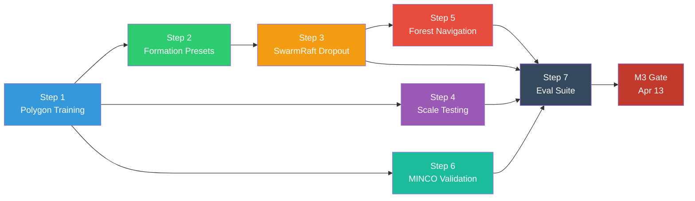
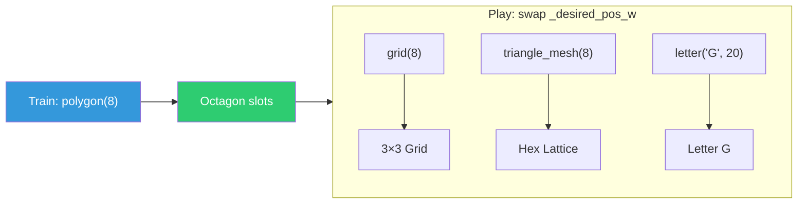
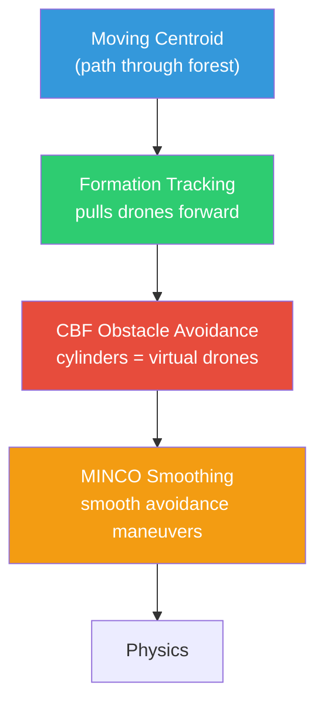

# Phase 4: Stress Testing

**Timeline:** Mar 30 -- Apr 13  |  **Gate:** M3 -- Mission success validation by Apr 13

## 1. Objectives Alignment

| Proposal Objective | Target | Phase 4 Approach |
| :--- | :--- | :--- |
| O1: Formation error | < 0.3m steady-state | Polygon-mode training with rigid slot tracking |
| O2: Velocity jitter reduction | >= 20% vs raw GNN | MINCO A/B comparison (play with/without) |
| O3: SwarmRaft recovery | < 2.0s gap-fill | Polygon dropout: octagon → heptagon transition |
| O4: 20+ agent HD demo | 20+ in obstacles | Train 8, deploy 20 via KNN + static obstacles |

## 2. Execution Steps (dependency order)



### Step 1: Polygon Formation Training (p4-1, p4-2)

Foundation for all Phase 4 work. Policy learns "go to assigned slot."

- Switch `formation_mode="polygon"`, `dropout_enabled=False`
- Velocity penalties bumped to -0.2 (steady-state hover)
- Train 1000 iterations, verify formation error < 0.3m
- Verify drones hold still once in position

**Success gate:** 8 drones form octagon, hold position, ep_len >= 400.

### Step 2: Formation Presets Module

New `formations.py` with switchable geometry presets:

- `polygon(N, radius)` — regular N-gon (training default)
- `grid(N, spacing)` — rectangular grid
- `triangle_mesh(N, spacing)` — equilateral triangle lattice
- `letter(char, N, size)` — letter outlines (G, A, S, etc.)

Each returns `[N, 3]` offsets from centroid. Train once with polygon,
swap to any shape at play time — policy tracks new goals without retraining.

Add `--formation` arg to `play.py` for shape switching.

### Step 3: Polygon SwarmRaft Dropout (p4-3, p4-4)

Enable dropout on polygon-trained checkpoint:

- `dropout_enabled=True`, retrain or fine-tune
- Dynamic slot recomputation: `_formation_offsets` recalculated for A-1
- Verify: octagon → heptagon visible transition within 2.0s (100 steps)
- Dead drone excluded from all computations (Phase 3 alive mask)

**Success gate:** Formation error returns to < 0.3m within 100 steps after dropout.

### Step 4: Scale Testing (O4)

Deploy 8-agent checkpoint at higher agent counts:

- Test at 10, 15, 20 agents with same checkpoint
- KNN obs + polygon offsets auto-scale (different N-gon geometry)
- Record: formation error, KNN distances, collision count
- If 20 fails: retrain at 16 as fallback

**Success gate:** 20 agents maintain formation without collisions.

### Step 5: Static Obstacle Environment (O4)

Add static cylinder obstacles to terrain:

- Random placement of 5-10 cylinders per env
- Extend CBF to include drone-obstacle barrier constraints
- Or: add obstacle positions to observations for policy-based avoidance
- Record success rate over 100 episodes

**Success gate:** > 95% success rate navigating through obstacles.

### Step 6: O2 Validation (MINCO Jitter Comparison)

A/B test with same checkpoint:

- Play 500 steps with `minco_enabled=True` → measure `std(lin_vel)`
- Play 500 steps with `minco_enabled=False` → measure `std(lin_vel)`
- Compute percent reduction

**Success gate:** >= 20% jitter reduction with MINCO.

### Step 7: Evaluation Suite + Testing Report Data

Systematic evaluation across all scenarios:

- Nominal polygon (8 agents, 25 episodes)
- Formation shapes (grid, triangle, letter_G at 16-20 agents)
- Agent loss (8 agents, kill 1, 25 episodes)
- Scale (10, 15, 20 agents, 25 episodes each)
- Obstacles (8 agents, static cylinders, 100 episodes)
- Dense formation (8 agents, target_spacing 0.3m, 25 episodes)

Collect all metrics below. Produce data tables for Testing Report (Phase 5).

### Presentation Metrics (post-processing script)

Computed from trajectory data — no env code changes needed.

| Metric | Why it's compelling | How to compute |
| :--- | :--- | :--- |
| Formation convergence time | "Drones reach octagon in X seconds" | Time until formation error < threshold |
| Dropout recovery time | "Swarm re-forms in X seconds after failure" (O3) | Steps from kill to formation error returning below threshold |
| Velocity jitter comparison | "MINCO reduces jitter by X%" (O2) | `std(lin_vel)` with/without MINCO |
| Scale degradation curve | "Formation quality vs number of agents" chart | Formation error at 8, 10, 15, 20 agents |
| CBF intervention rate | "Safety shield activates X% of steps" | Count steps where CBF modifies actions |
| Energy proxy | "Total thrust integral as efficiency metric" | Sum of thrust commands over episode |

Implementation: `scripts/eval_metrics.py` — reads trajectory `.pt` files
and TB event logs, outputs a metrics summary table and charts.

## 3. New Components

### Formation Geometry System (`formations.py`)

Train once in polygon mode, play any shape. Core idea: policy learns
"go to assigned goal slot" — the slot coordinates determine the shape.



Switchable mid-episode via `--formation` play.py argument.

### Dynamic Slot Recomputation (SwarmRaft + Polygon)

When a drone drops out, recompute formation for N-1 alive agents:


### Forest Navigation (Moving Centroid + CBF Obstacles)

The swarm navigates through a "cluttered forest" of static cylinders
using two mechanisms — no retraining needed:

**Moving centroid goal:** The group centroid (`_group_goal_local`) moves
along a predefined path each step (e.g., constant velocity in +X).
The formation tracking reward naturally pulls the swarm forward. The
policy already learned "go to your slot around the centroid" — if the
centroid moves smoothly, the drones follow in formation.

```text
Step 0:   centroid at (0, 0, 1.0)  → drones form octagon here
Step 100: centroid at (2, 0, 1.0)  → drones track to new position
Step 200: centroid at (4, 0, 1.0)  → swarm moved 4m through forest
...
```

**CBF obstacle avoidance:** Treat each cylinder as a fixed virtual drone
in the CBF barrier computation. CBF already enforces
`||p_i - p_j||^2 > d_safe^2` between drone pairs — adding cylinder
center positions as immovable agents gives free obstacle avoidance with
zero retraining. MINCO smooths the avoidance maneuvers.



**Forest layout:** 10-20 cylinder prims at random XY positions along the
path, with gaps of 2-3m between trunks (wide enough for the swarm to
pass through while requiring formation deformation). Cylinders spawned
in `_setup_scene` as static rigid bodies.

**Implementation files:**

- `ggswarm_env.py` (`_setup_scene`): spawn cylinder prims
- `cbf.py`: add obstacle positions as virtual agents in barrier loop
- `ggswarm_env.py` (`_pre_physics_step`): advance centroid along path
- `play.py`: `--forest` flag to enable obstacle terrain + moving goal

## 4. Pass Criteria (M3 Gate)

| Criterion | Threshold | Objective |
| :--- | :--- | :--- |
| Formation error (polygon, steady-state) | < 0.3m | O1 |
| Velocity jitter reduction (MINCO vs raw) | >= 20% | O2 |
| Gap-fill latency after dropout | < 2.0s (100 steps) | O3 |
| Scale test (20 agents) | Formation maintained | O4 |
| Obstacle success rate | > 95% / 100 episodes | O4 |
| Inter-agent collision rate | 0 / 100 episodes | O1 |
| Steady-state hover drift | < 0.05 m/s mean velocity | O2 |

## 5. Results

Phase 4 in progress. Started Mar 30.

- **p4-1:** Polygon mode + velocity -0.2 + MINCO/CBF. Training...

---

## See Also

- [Phase 3: Muscle Refinement](phase3_muscle_refinement.md)
- [Architecture](../design/architecture.md)
- [Proposal Objectives](../project/proposal.md)
