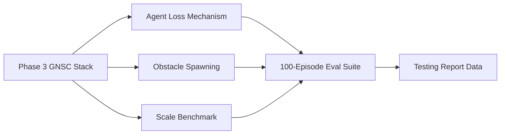

# Phase 4: Stress Testing

**Timeline:** Apr 8 -- Apr 14 (Week 14)  |  **Gate:** M3 -- Mission success validation

## 1. Goals

| ID | Goal | Success Criteria |
| :--- | :--- | :--- |
| P4.1 | Swarm recovers from in-episode agent loss | Formation re-syncs in < 2.0 s across >= 90% of kill events (O3) |
| P4.2 | Zero collisions in obstacle environments | 0 inter-agent or agent-obstacle collisions over 100 evaluation episodes |
| P4.3 | Swarm scales to 20+ agents | Formation error < 0.5 m and VRAM < 20 GB at 20 agents |
| P4.4 | Testing Report data produced | Metrics table covering nominal, agent-loss, sparse, and dense obstacle scenarios |

## 2. Tasks

Extend the Phase 3 stack with three test dimensions, all gated behind config flags:

**Agent loss simulation** -- add `agent_loss_enabled`, `agent_loss_interval_min/max` to
`GGSwarmMarlEnvCfg`. Force-terminate one agent per episode at a random step via
`_force_terminated` mask in `_get_dones`. Measure gap-fill latency (steps from kill to
formation error returning below 0.5 m).

**Obstacle environments** -- add `obstacle_enabled`, `obstacle_count`, `obstacle_radius`,
`obstacle_height`, `obstacle_field_size`, `cbf_obstacle_d_safe` to config. Spawn static
cylinders in `_setup_scene` using `RigidObjectCfg`. Activate `apply_cbf_obstacle_safety`
in `cbf_safety.py` when obstacles are present.

**Scale benchmarking** -- `scripts/bench_scale.py` sweeps `num_agents` (3, 5, 10, 15, 20, 25) and records mean formation error, VRAM usage, steps/second, and CBF computation fraction.

**100-episode evaluation suite** -- run 25 episodes each across four scenarios (nominal, agent kill, sparse obstacles, dense obstacles) via `scripts/eval_phase3.py` with Phase 4 configs.

Scenario presets live in `drone_swarm_env_cfg_showcase.py` with task IDs: `Template-GGSwarm-Marl-Phase4-v0`, `GGS-ClutteredForest-v0`, `GGS-UrbanCanyon-v0`.

## 3. Design Integration

Phase 4 extends the Phase 3 stack without modifying core modules. All additions are environment-level (obstacle spawning, kill mechanism) and evaluation tooling.

New config parameters:

| Parameter | Default | Description |
| :--- | :--- | :--- |
| `agent_loss_enabled` | `False` | Enable in-episode agent kill |
| `agent_loss_interval_min` | 200 | Earliest kill step |
| `agent_loss_interval_max` | 500 | Latest kill step |
| `obstacle_enabled` | `False` | Enable static cylinder obstacles |
| `obstacle_count` | 10 | Obstacles per environment |
| `obstacle_radius` | 0.15 | Cylinder radius (m) |
| `obstacle_height` | 2.0 | Cylinder height (m) |
| `obstacle_field_size` | 2.0 | Half-side of placement zone (m) |
| `cbf_obstacle_d_safe` | 0.20 | Safety radius around each obstacle (m) |

Pass criteria (all must hold):

| Criterion | Threshold | Proposal Objective |
| :--- | :--- | :--- |
| Inter-agent collision rate | 0 events / 100 episodes | O1 |
| Agent-obstacle collision rate | 0 events / 100 episodes | O1 |
| Gap-fill latency (median) | < 2.0 s | O3 |
| Formation error, nominal (mean) | < 0.5 m | O1 |
| VRAM at 20 agents | < 20 GB | O4 |

Cross-references: `docs/design/architecture.md`, `docs/phases/phase3_muscle_refinement.md`.

## 4. Results

Phase 4 has not started.

---

## See Also

- `docs/phases/phase3_muscle_refinement.md` -- Phase 3: CBF, SwarmRaft, MINCO
- `docs/design/architecture.md` -- GNSC 5-layer architecture
