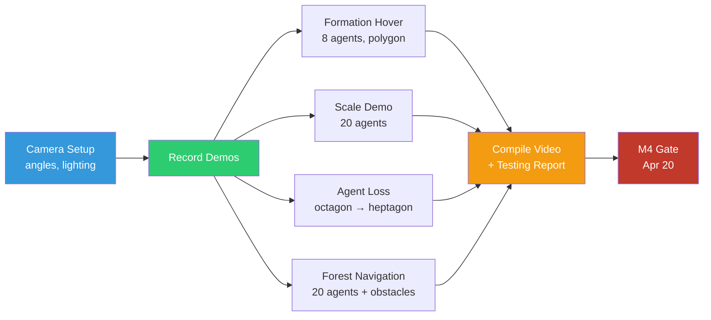

# Phase 5: Showcase Prep

**Timeline:** Apr 14 -- Apr 20  |  **Gate:** M4 -- HD showcase and Testing Report delivered

## 1. Goals

| ID | Goal | Success Criteria |
| :--- | :--- | :--- |
| P5.1 | HD demo video of swarm formation | >= 1080p, >= 30 s, showing formation + fault recovery |
| P5.2 | Proposal objectives verified | Testing Report finalized with pass/fail |
| P5.3 | Formation error < 0.5 m steady-state | Verified across evaluation suite |
| P5.4 | Presentation-ready repository | Clean README, reproducible commands |

## 2. Tasks



No new environment or policy code. All work is recording, documentation,
and polish.

**Visual setup** — configure camera angles for the best formation view.
Use `env_spacing=0.01` (play mode) so drones are visually together.
Set `formation_centroid = (0, 0, 1.0)` for centered hover.

**HD demo recording** — record scenario sequences using NVENC recorder:

- Formation hover (3 agents, 15 s) — triangle formation at centroid
- Scale demo (6-10 agents, 15 s) — larger swarm, same checkpoint
- Agent loss recovery (3 agents, 15 s) — kill drone, watch re-form
- Full scenario (10+ agents, 30 s) — combined demo

Commands:

```powershell
# 3-agent formation demo
python scripts/skrl/play.py --task ggswarm-v0 --num_agents 3 --num_envs 3 `
  --policy gnn --checkpoint <path> --video --video_prefix showcase-3

# 10-agent scale demo
python scripts/skrl/play.py --task ggswarm-v0 --num_agents 10 --num_envs 10 `
  --policy gnn --checkpoint <path> --video --video_prefix showcase-10
```

**Testing Report** — compile Phase 4 evaluation results into
`docs/testing_report.md` with:

- Objective pass/fail table (O1-O4)
- Formation error metrics by scenario
- Scale benchmark results
- Trajectory plot comparisons (MLP vs GNN, 3 vs 10 agents)

## 3. Design Integration

No architectural changes. Consumes Phase 4 validated stack and packages
for presentation.

| Deliverable | Source |
| :--- | :--- |
| Demo videos | NVENC recorder output |
| Trajectory plots | `ggswarm.viz.trajectory_plots` |
| Testing Report | Phase 4 evaluation data |

## 4. Results

Phase 5 has not started.

---

## See Also

- [Phase 4: Stress Testing](phase4_stress_testing.md)
- [Phase 6: Delivery](phase6_delivery.md)
