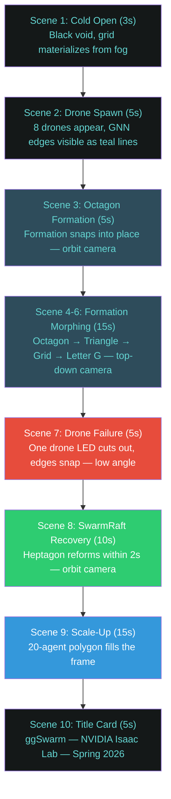
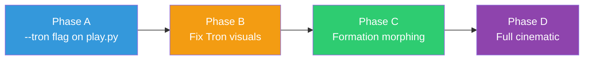

# Phase 5: Showcase Prep

**Timeline:** Apr 14 -- Apr 20  |  **Gate:** M4 -- HD showcase and Testing Report delivered

**Status:** Started 2026-04-07, **7 days early.** Phase 4 wrapped after the
forest-deflection rebuild produced clean obstacle navigation
(`p4-revert-4` checkpoint, 0 body penetrations through 0.20m-radius trunks).
Phase 5 begins by capturing HD video against the working forest scenario
before moving to the Tron-styled trailer.

**Production checkpoint:** [logs/skrl/ggswarm/p4/2026-04-06_21-09-24_ppo_torch/checkpoints/best_agent.pt](../../logs/skrl/ggswarm/p4/2026-04-06_21-09-24_ppo_torch/checkpoints/best_agent.pt)
(reward 66.83, ep_len 307.74, formation tracking + flock-aligned forest
navigation).

## 1. Goals

| ID | Goal | Success Criteria |
| :--- | :--- | :--- |
| P5.1 | Cinematic trailer (~2:30) | Tron-inspired, 1080p 60fps, 8 scenes, formation morphing + dropout |
| P5.2 | Proposal objectives verified | Testing Report finalized with pass/fail for O1-O4 |
| P5.3 | Formation error < 0.3m steady-state | Verified across evaluation suite |
| P5.4 | Presentation-ready repository | Clean README, reproducible commands |

## 2. Cinematic Trailer (P5.1)

### Concept

Tron Legacy-inspired cinematic showcase. Dark void, volumetric teal fog,
emissive drone materials, cinematic camera rigs. Signature color: #64d5d2
(Gary Gigabytes teal). ~2:30 runtime at 1080p 60fps.

### Storyboard



### Technical Implementation

| Component | File | Description |
| :--- | :--- | :--- |
| Tron environment | `scripts/tron_env.py` | Black void, fog, grid, lighting, drone materials, camera rigs |
| Showcase script | `scripts/showcase.py` | Scene sequencer, formation morphing, dropout orchestration |
| Trained policy | p4-6 checkpoint | Triangle mesh + dropout trained, generalizes to all shapes |

### Tron Environment Features

- **Black void stage** — default lights removed, RTX path tracing enabled (32 SPP)
- **Volumetric fog** — tinted #64d5d2, subtle density (0.08), 3-25m range
- **Emissive grid plane** — 50m quad with teal OmniPBR emissive material
- **3-point cinematic lighting** — key (teal-white), fill (navy), rim (bright teal edge glow)
- **Drone material** — near-black metallic body + #64d5d2 emissive LED at intensity 10

### Camera Rigs (TronCameraRig)

| Mode | Description | Used In |
| :--- | :--- | :--- |
| `orbit` | Slow 360° around swarm centroid | Scenes 1-3, 8-10 |
| `top_down` | Locked overhead — formation shape reveal | Scenes 4-6 |
| `low_angle` | Dramatic ground-level looking up | Scene 7 (drone failure) |
| `chase` | Follows swarm centroid | Optional |

### Implementation Plan (incremental, 4 phases)

Build the showcase incrementally — each phase independently testable.
Do NOT try to do everything at once.



**Phase A: `--tron` flag on play.py** (~30 lines)

Add Tron visuals to the existing working play.py. No new wrapper ordering,
no scene sequencing. Just call `setup_tron_environment()` after `gym.make()`
but before `NvencRecorder`, create a `TronCameraRig`, and step it each frame.

```powershell
python scripts/skrl/play.py --task ggswarm-v0 --checkpoint <path> `
    --tron --video --prefix p5-tron-test
```

**Phase B: Fix Tron visuals** (iterative)

Debug colors: verify `/World/Light` and `/World/ground` removal, test
emissive materials in RTX-Interactive vs Path Tracing mode, tweak fog
density and grid material. Only modify `scripts/tron_env.py`.

**Phase C: Formation morphing via `--showcase`** (~50 lines)

Add `--showcase` flag to play.py that enables scripted formation changes
at timed intervals. Reuse existing `get_formation()` + nearest-slot
assignment. No separate showcase.py needed.

```powershell
python scripts/skrl/play.py --task ggswarm-v0 --checkpoint <path> `
    --tron --showcase --video --prefix p5-showcase
```

**Phase D: Full cinematic** (drone kill + camera cuts)

Add SwarmRaft dropout trigger, camera mode switching (orbit → top_down →
low_angle), and optional scale-up. Either extend play.py `--showcase`
or keep in separate `scripts/showcase.py`.

### Files

| Phase | File | Changes |
| :--- | :--- | :--- |
| A | `scripts/skrl/play.py` | `--tron` flag, call setup_tron_environment, step TronCameraRig |
| B | `scripts/tron_env.py` | Fix light/ground removal, test materials |
| C | `scripts/skrl/play.py` | `--showcase` flag with formation timer |
| D | `scripts/showcase.py` or `play.py` | Drone kill, camera cuts |

## 3. Testing Report (P5.2)

Compile Phase 4 evaluation results into `docs/testing_report.md`:

- Objective pass/fail table (O1-O4) with measured values
- Formation error metrics by scenario (polygon, grid, letter, scale)
- SwarmRaft recovery time measurements
- MINCO jitter A/B comparison data
- Scale benchmark results (8, 10, 15, 20 agents)
- Trajectory plot gallery

## 4. Design Integration

No architectural changes. Consumes Phase 4 validated stack and packages
for presentation.

| Deliverable | Source |
| :--- | :--- |
| Cinematic trailer | `scripts/showcase.py` + `scripts/tron_env.py` |
| Demo clips | `scripts/skrl/play.py` with `--prefix` |
| Trajectory plots | `ggswarm.viz.trajectory_plots` |
| Testing Report | Phase 4 evaluation data + `scripts/eval_metrics.py` |

## 5. Results

Phase 5 early start (Mar 31) — showcase script and Tron environment created.
Full recording scheduled for Apr 14-20 after Phase 4 testing complete.

- **p5-1:** Showcase script created. Tron environment with fog, grid, lighting.
  8-scene cinematic sequence with formation morphing + SwarmRaft dropout.
  Using p4-6 checkpoint (triangle + dropout, 1000 iter).

---

## See Also

- [Phase 4: Stress Testing](phase4_stress_testing.md)
- [Phase 6: Delivery](phase6_delivery.md)
- [Assumptions](../design/assumptions.md)
