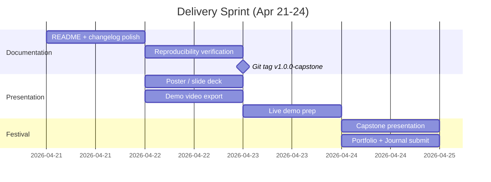

# Phase 6: Delivery

**Timeline:** Apr 21 -- Apr 24  |  **Gate:** Final -- Capstone Festival presentation and all submissions

## 1. Goals

| ID | Goal | Success Criteria |
| :--- | :--- | :--- |
| P6.1 | Capstone Festival presentation delivered | Live demo or recorded video at poster session |
| P6.2 | Portfolio and Learning Journal submitted | Per-course requirements met by Apr 24 |
| P6.3 | Repository reproducible from scratch | Reviewer can train/play using only README |
| P6.4 | Final documentation complete | All phase docs and architecture doc up to date |

**Hard deadline: Apr 24, 2026.** All work must be complete and submitted.

## 2. Tasks



No new code. Four-day sprint converting Phase 5 results into deliverables.

**Day 1 (Apr 22): Documentation and repo polish**

- Update `README.md` to final state
- Finalize changelog entries for all phases
- Run reproducibility verification:

  ```powershell
  pip install -e source/ggswarm
  python scripts/skrl/train.py --headless --task ggswarm-v0 --num_envs 64 --num_agents 3 --max_iterations 5
  python scripts/skrl/play.py --task ggswarm-v0 --num_agents 3 --num_envs 3 --policy gnn --checkpoint <path>
  ```

- Tag `v1.0.0-capstone`

**Day 2 (Apr 23): Presentation materials**

- Build poster/slide deck (10 slides: title, problem, GNSC architecture,
  Phase 2 results, Phase 3 GNN, Phase 4 stress tests, showcase demo,
  results vs objectives, lessons learned, future work)
- Export demo video with QR code
- Prepare live demo machine

**Day 3 (Apr 24): Capstone Festival**

- Present poster and run live demo
- Submit Portfolio and Learning Journal
- Archive final GCS state

## 3. Deliverables Checklist

- Academic: Learning Journal, portfolio entry, Testing Report
- Festival: poster/slides, HD demo video (<= 3 min), live demo
- Repository: final README, verified install, git tag `v1.0.0-capstone`

## 4. Documentation Review

| File | Action |
| :--- | :--- |
| `docs/design/architecture.md` | Verify reflects final architecture |
| `docs/status/changelog.md` | Add Phase 5 and 6 entries |
| `docs/status/weekly_updates.md` | Add final week entry |
| All `phase*.md` docs | Confirm objectives reflect actual results |
| `README.md` | Final commands and quickstart |

## 5. Results

Phase 6 has not started.

---

## See Also

- [Proposal](../project/proposal.md)
- [Phase 5: Showcase Prep](phase5_showcase_prep.md)
