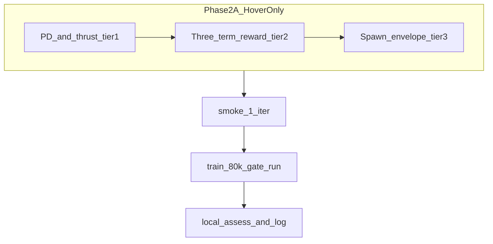

# Phase 2A next run (merged): eval readout, parameters, convergence, docs

**Workspace copy** — lives in-repo so it shows in the Cursor file tree. A duplicate may exist under `~/.cursor/plans/`; **treat this file as the editable source** when working in ggSwarm.

**Implemented (2026-03-22):** PD2 bundle in `drone_swarm_env_cfg.py` + docs/changelog per plan.

**Rule 22 smoke (done, local):** `debug smoke --task Template-GGSwarm-Marl-HoverStability-v0 --iterations 1 --gnn --headless` — exit 0 (~20 s). Five-field check vs `GGSwarmMarlHoverStabilityCfg`:

| Field | Value (PD2 hover run) |
| :--- | :--- |
| `rew_scale_pos` | 18.0 |
| `rew_scale_vel` | -0.05 |
| `rew_scale_terminated` | 0.0 |
| `curriculum_start_step` | 999999 (hover-only lock) |
| `spawn_yaw_range` | 0.3 |

**Done (2026-03-22):** GCE 80k PD2 run `2026-03-22_07-03-55_mappo_torch` → pulled → `hover-stability assess` → `run_history.md` + changelog (**FAIL**; see changelog).

This file **combines** the former `phase_2a_param_tuning_5a65d416` plan into this canonical next-run plan.

---

## Phase 2A scope (from docs)

Per [docs/design/phase2_brain_development.md](../design/phase2_brain_development.md):

- **Sub-phase A** = hover-stability only: `hover-stability train`, task `Template-GGSwarm-Marl-HoverStability-v0`, config [GGSwarmMarlHoverStabilityCfg](../../source/ggSwarm/ggSwarm/tasks/direct/ggswarm_marl/drone_swarm_env_cfg.py).
- **Gates**: `survival_steps > 500`, `airborne_ratio > 0.9`, `mean_roll < 15°` (plus existing scorecard metrics).
- **Formation is not an objective** in A. **`mean_formation_error_m`** is a **position/spread proxy**, not a Phase 2A pass condition — do not tune formation/curriculum for 2A based on it ([`scorecard.py` DECISION_HINTS](../../scripts/ggswarm_utils/scorecard.py)).

Sub-phase B (formation) is **out of scope** until A passes.

---

## What the last assess scorecard implies (PD1 run)

Representative **2026-03-22_04-32-04_mappo_torch** assess:

| Signal | ~Value | Read |
| :--- | :--- | :--- |
| `mean_roll_deg` | ~22° (WARN vs 15°) | **PD inner loop is helping** vs earlier ~60°+ runs — attitude is not the only bottleneck anymore. |
| `airborne_ratio` | ~0.54 (FAIL vs 0.9) | Too much time **low / near ground** — **thrust + altitude / position** priority. |
| `ground_hit_rate` | ~0.82 (FAIL vs 0.05) | Same — **vertical authority** and holding goal height. |
| `mean_formation_error_m` | ~12 m (FAIL on card) | **Ignore for 2A gate** — formation rewards are **0** in hover-stability cfg. |

**Knobs to move:** hover height / thrust / PD limits / `rew_scale_pos` — **not** formation, and **not** `rew_scale_upright` / `rew_scale_alive` unless you explicitly change hover-stability design and log it (Rules 5–6).

**Alignment:** Tunables only in [`GGSwarmMarlEnvCfg`](../../source/ggSwarm/ggSwarm/tasks/direct/ggswarm_marl/drone_swarm_env_cfg.py) / [`GGSwarmMarlHoverStabilityCfg`](../../source/ggSwarm/ggSwarm/tasks/direct/ggswarm_marl/drone_swarm_env_cfg.py). Scorecard hints in [`scorecard.py`](../../scripts/ggswarm_utils/scorecard.py) already point at thrust/PD + `rew_scale_pos`.

---

## Convergence on Run PD1 — is **80k** enough? Can you **lower** it?

From `logs/skrl/ggswarm_marl/2026-03-22_04-32-04_mappo_torch/assess_report.md` / TensorBoard narrative:

| Signal | Value | Interpretation |
| :--- | :--- | :--- |
| Peak reward | **~2758 @ step 77,000** | Objective still moving **late** in training — not “done” at 20k–40k. |
| Final vs peak | **~1808 @ 80k** vs peak | **Drawdown** late run — worth confirming in TensorBoard (noise vs regression). |
| Entropy collapse | **Not detected** | Policy still **exploring** at 80k; stopping much earlier risks cutting off useful learning. |
| Tool “recommended budget” | ~**92k** | `check_convergence.py` heuristic when collapse absent — **not** a guarantee that 92k fixes eval gates. |

### Policy on training length

1. **Gate-chasing run (want a real PASS/WARN decision on assess):** keep **≥ 80k** iterations while entropy collapse is **absent** and reward moved **through ~77k** on PD1. Shortening below 80k for this purpose is **not recommended** — you would likely stop **before** the regime where PD1 peaked.

2. **Lowering below 80k — when it *is* OK:** only for **fast A/B ablations** (e.g. compare two `thrust_to_weight` or `rew_scale_pos` values at **40k–50k**), with the explicit rule that **assess gates are not authoritative** until a **full-length** run completes. Cheap iteration, not a milestone claim.

3. **Longer than 80k:** if a **new** config’s TensorBoard still shows **rising reward** (or no collapse) past 80k, **90k–100k** is reasonable **after** smoke + sanity check — not by default on every run.

**Bottom line:** **Yes, it is possible to lower 80k**, but **only for comparative / diagnostic runs**, not as the default budget for declaring Phase 2A progress. PD1 data argues **against** shortening the “real” gate run.

---

## Recommended parameter strategy (hover-only)

PD1 failure mode: **attitude improved** but **altitude / ground** bad — prioritize **thrust / altitude authority** and **position reward**.

**Tier 1 — Inner loop + thrust** (base `GGSwarmMarlEnvCfg`, inherited by hover):

- `thrust_to_weight`: **1.9 → 2.0** (more collective at neutral action) — changelog rationale.
- `kp_att`: **0.03 → 0.045–0.06** (faster tilt correction when recovering from low).
- `max_moment`: **0.02 → 0.03** (less saturation on large errors; watch twitchiness).
- `kd_att` optional: **0.005 → 0.006–0.008** if Tier 1 feels oscillatory.

**Tier 2 — 3-term hover reward** (`GGSwarmMarlHoverStabilityCfg`):

- `rew_scale_pos`: **15 → 18–20**.
- `rew_scale_vel` optional **one knob**: **-0.05 → -0.04** only if TensorBoard shows high speed + poor altitude.

**Tier 3 — Spawn envelope** (if Tier 1–2 stall):

- `spawn_z_min` / `spawn_z_max`: slightly **raise floor** or **narrow band** — changelog + rationale (Rule 6: spawn z is not implied by `min_height` alone).

**Avoid in Phase 2A:** formation/cohesion/separation (already 0); re-enabling `rew_scale_upright` / `rew_scale_alive` without a documented design change.

---

## Plan review — will this improve the next run?

**We cannot guarantee** a better scorecard until the run finishes; this bundle is **hypothesis-driven** from PD1: good roll progress, bad **airborne_ratio** / **ground_hit_rate**. The logic chain:

| Symptom (PD1) | Mechanism | Planned lever | Expected effect (if hypothesis is right) |
| :--- | :--- | :--- | :--- |
| Low airborne, high ground hits | Net lift or usable thrust while tilted is marginal | `thrust_to_weight` ↑ | More total thrust at the same normalized collective command → easier to hold **spawn \(z\)** (goal \(z\) is set from spawn in `_reset_idx`). |
| Same | Policy commands tilt; PD **saturates** (`max_moment`) or corrects slowly | `max_moment` ↑, `kp_att` ↑ | Moments can match desired roll/pitch faster and through larger errors → **vertical component of thrust** recovers sooner after disturbances. |
| Same | 3D distance reward too weak vs penalties / dynamics | `rew_scale_pos` ↑ | Stronger gradient on **full** `desired_pos_w − pos_w` (includes **altitude**; there is no separate altitude term). |
| Optional high speed + sink | Velocity penalty fights altitude recovery | `rew_scale_vel` less negative (later, one knob) | Slightly less penalty on aggressive corrections — **only** if TensorBoard shows speed/altitude tradeoff. |

**What would falsify “wrong direction” after the run?**

- **Worse mean_roll** or violent twitching → reduce `kp_att` bump or raise `kd_att` slightly; check `max_moment` not too high for the asset.
- **Better roll, still terrible ground** with oscillation → prioritize `kd_att` / slightly lower `kp_att` before adding more `thrust_to_weight`.
- **Entropy collapse very early** → training / LR / network issue, not primarily these physics knobs.

**Default single bundle for the next gate run (pick one line in changelog):**

- `thrust_to_weight`: **2.0**
- `kp_att`: **0.045** (middle of 0.045–0.06; go higher only if smoke + short train look tame)
- `max_moment`: **0.03**
- `kd_att`: leave **0.005** unless eval/smoke shows oscillation; then try **0.006**
- `rew_scale_pos`: **18** (middle of 18–20)

Tier 3 (`spawn_z_*`) stays **off** unless this bundle still fails on **airborne/ground** with acceptable roll.

---

## Documentation hygiene

- [docs/ops/training_workflow.md](../ops/training_workflow.md): Step 0 grep/checklist — **stale** vs PD + hover rewards + **512** envs; update to PD fields + hover scales + `num_envs` for HoverStability.
- [docs/design/phase2_brain_development.md](../design/phase2_brain_development.md): optional footnote under Phase A row — `mean_formation_error_m` not a 2A gate.
- [docs/ops/post_train_analysis.md](../ops/post_train_analysis.md): optional — Phase 2A FAIL matrix should not contradict PD + 3-term hover (no stale `rew_scale_upright` as first-line advice).

---

## Eval video (headless) — **shipped**

Unified eval and assess support **`--video`** (offscreen `rgb_array`, output under `<run_dir>/videos/eval/`). See [scripts/eval.py](../../scripts/eval.py), [scripts/ggswarm_utils/eval_runner.py](../../scripts/ggswarm_utils/eval_runner.py), [docs/ops/commands.md](../ops/commands.md). Use a **real** run folder name, not the literal `<run>` placeholder (Windows path rules).

**Optional clip after assess:**

`python scripts/run.py hover-stability eval --headless --video --checkpoint logs/skrl/ggswarm_marl/<timestamp>_mappo_torch/checkpoints/best_agent.pt`

---

## Execution order (after you approve implementation)

1. Apply **one bundle**: Tier 1 + **one** Tier-2 knob in `drone_swarm_env_cfg.py`.
2. **Smoke:** ~~`python scripts/run.py debug smoke --task Template-GGSwarm-Marl-HoverStability-v0 --iterations 1 --gnn`~~ **done** (2026-03-22); five-field table above.
3. **Train:** GCE **80k** default for gate run; **shorter only** if labeled ablation; consider **92k–100k** only if TensorBoard justifies.
4. **Assess** locally; append [docs/status/run_history.md](../status/run_history.md) + [docs/status/changelog.md](../status/changelog.md); **do not** gate 2A on `mean_formation_error_m`.

---

## Note on Cursor plan copies

The same content may exist under `%USERPROFILE%\.cursor\plans\phase_2a_next-run_tuning_48a44428.plan.md` — that path is **outside** the ggSwarm repo, so it does not show in the project sidebar. **Edit this file** (`docs/project/phase_2a_next-run_tuning.plan.md`) when updating the plan in-repo.

`phase_2a_param_tuning_5a65d416` content was **merged** here; keep this file as the single source of truth for Phase 2A next-run work.
