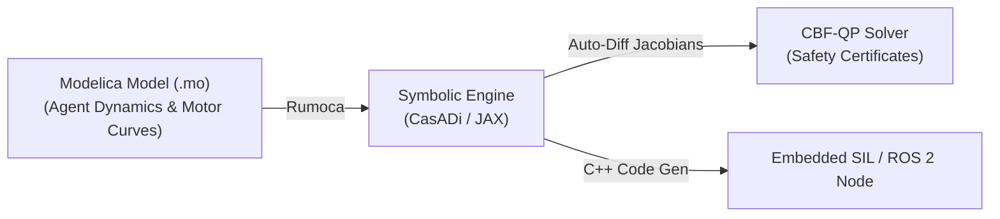

# Rumoca & Symbolic Simulation Workflow for ggSwarm

This document details how **Rumoca** (Rust Modelica compiler) and symbolic mathematics backends support decentralized swarm control (GNN + CBF-QP) research in **ggSwarm**.

---

## 1. Rumoca for Swarm Dynamics & Control Formulation

### Why Modelica + Rumoca for Swarm R&D?
Decentralized control algorithms require clean mathematical representations of agent dynamics and safety boundaries (Control Barrier Functions - CBFs).

1. **Declarative Modeling:** Define complex physical quadrotor dynamics (aerodynamics, gyroscopic precessions, ground effect) in Modelica standard syntax.
2. **Symbolic Compilation via Rumoca:** Rumoca exports symbolic computation graphs to **CasADi** or **JAX** in Python.
3. **Control Barrier Function (CBF) Derivation:**
   - Automatically compute Lie derivatives $L_f h(x)$ and $L_g h(x)$ of safety barrier functions $h(x)$ for inter-agent collision avoidance:
     $$\dot{h}(x) = L_f h(x) + L_g h(x) u \ge -\gamma(h(x))$$
4. **Target C++ Code Generation:** Compile optimized C/C++ target code via Rumoca's MiniJinja templates for real-time execution in ROS 2 control loops.

---

## 2. Multi-Agent 3D Simulators Comparison

While Rumoca handles equation compilation and optimization, multi-agent evaluation requires a 3D environment simulator:

| Simulator | Strengths | Swarm Scale | Best Use Case in ggSwarm |
| :--- | :--- | :--- | :--- |
| **PyBullet** | Lightweight Python API, fast rigid-body collision checks. | 100+ agents | Fast RL / GNN training loops & policy evaluation. |
| **Crazyswarm2 / Webots** | Native ROS 2 interface, built-in multi-quadrotor physics. | 20–50 agents | Decentralized CBF-QP flight controller testing. |
| **Gazebo Harmonic (Ignition)** | High-fidelity physics (DART/ODE), sensor rendering (LiDAR/Depth). | 1–20 agents | Search-and-rescue obstacle environment validation. |

---

## 3. Integration Plan with ggSwarm Pipeline

1. **Offline Optimization:** Use **Rumoca + CasADi** to derive nominal control laws and verify CBF feasibility bounds under parameter uncertainty.
2. **Algorithm Execution:** Run GNN policy + CBF-QP safety filter in **PyBullet** or **Crazyswarm2**.
3. **Hardware Deployment:** Export Rumoca-generated C++ dynamic matrices directly into flight control software nodes.
